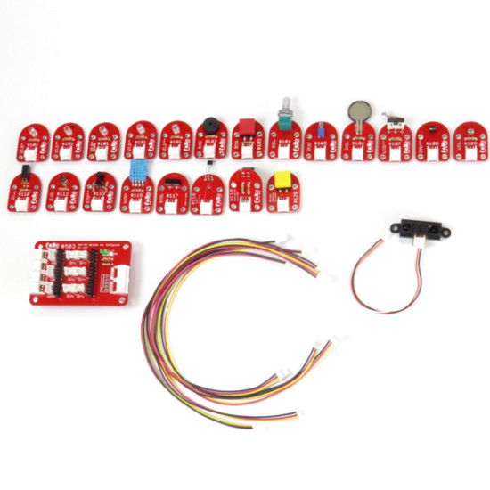

# #008 FaBo Complete Kit for IchigoJam

<!--COLORME-->

## Overview
すべてのFaBo Brickを試したい方に、すべてのFaBo Brickをコンプリートしたパッケージです。

Arduino UNO、Raspberry Pi、IchigoJam3種類に対応したOUT/INシールドとケーブルもセットになっていますので、すぐにIoTプロトタイピングがはじめられます。

IchigoJamなどマイコン本体は含まれません。別途、お買い求めください。

## 内容物一覧

|ID|Brick|数量|
|--|--|--|
|#101|[LED(Blue, Green, Red, White, Yellow)](http://fabo.io/101_A.html)|各1個|
|#102|[Buzzer Brick](http://fabo.io/102.html)|1個|
|#103|[Button Brick](http://fabo.io/103.html)|1個|
|#104|[Angle Brick](http://fabo.io/104.html)|1個|
|#105|[Vibrator Brick](http://fabo.io/105.html)|1個|
|#106|[Touch Brick](http://fabo.io/106.html)|1個|
|#107|[LimitSwitch Brick](http://fabo.io/107.html)|1個|
|#108|[Temperature Brick](http://fabo.io/108.html)|1個|
|#109|[Light Brick](http://fabo.io/109.html)|1個|
|#110|[Tilt Brick](http://fabo.io/110.html)|1個|
|#112|[IR LED Brick](http://fabo.io/112.html)|1個|
|#113|[IR Receiver Brick](http://fabo.io/113.html)|1個|
|#115|[Humidity Brick](http://fabo.io/115.html)|1個|
|#116|[Distance Brick](http://fabo.io/116.html)|1個|
|#503|[OUT/IN Shield for IchigoJam](http://fabo.io/503.html)|1個|
|#701|[I2C Expand Board](http://fabo.io/701.html)|1個|
|#1301|[3Pinケーブル](http://fabo.io/1301.html)|5本|
|#1302|[4Pinケーブル](http://fabo.io/1302.html)|5本|

商品入替え、または販売中止などの理由により、予告なく内容物が変更される場合があります。

## Github

https://github.com/FaBoPlatform/FaBo/tree/master/0008_completekit_ichigojam
