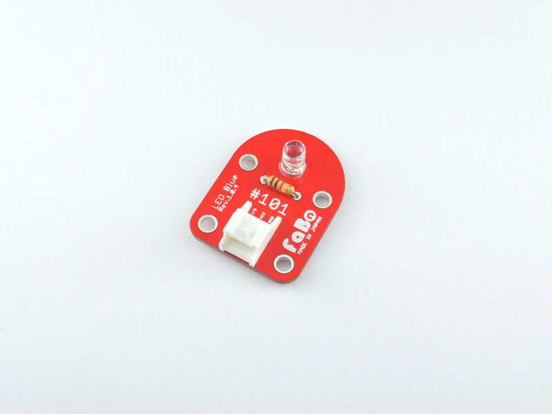

# #101 LED Brick

<!--COLORME-->

## Overview
LEDのBrickです。発光色は5色（青・緑・赤・白・黄）あります。Lチカのおともにもどうぞ。

※購入時は色の間違いにご注意ください。111

## Support
|Arduino|RaspberryPI|IchigoJam|
|:--:|:--:|:--:|
|◯|◯|◯|

## Schematic

## Docs

* [Arduino用サンプル](http://docs.fabo.io/fabo/arduino/brick_analog/101_brick_analog_led.html)
* [RaspPi用サンプル](http://docs.fabo.io/fabo/rasppi/brick_analog/101_brick_analog_led.html)
* [IchogoJam用サンプル](http://docs.fabo.io/fabo/ichigojam/brick_analog/101_brick_analog_led.html)

## Parts
- 5mm LED(各色)

## GitHub
- https://github.com/FaBoPlatform/FaBo/tree/master/0101_led
