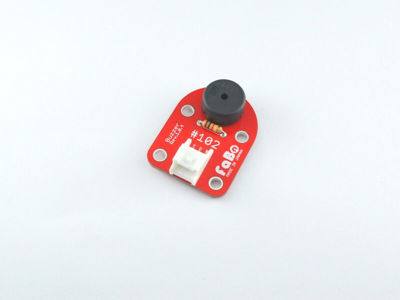

# #102 Buzzer Brick

<!--COLORME-->

## Overview
圧電ブザーを使ったBrickです。I/Oピンより、鳴らす音や音の長さを制御することができます。

## Support
|Arduino|RaspberryPI|IchigoJam|
|:--:|:--:|:--:|
|◯|x|◯|

## Schematic

## Docs

* [Arduino用サンプル](http://docs.fabo.io/fabo/arduino/brick_analog/102_brick_analog_buzzar.html)
* [RaspPi用サンプル](http://docs.fabo.io/fabo/rasppi/brick_analog/102_brick_analog_buzzar.html)
* [IchogoJam用サンプル](http://docs.fabo.io/fabo/ichigojam/brick_analog/102_brick_analog_buzzar.html)

## Parts
- 圧電ブザー

## GitHub
- https://github.com/FaBoPlatform/FaBo/tree/master/0102_buzzer
