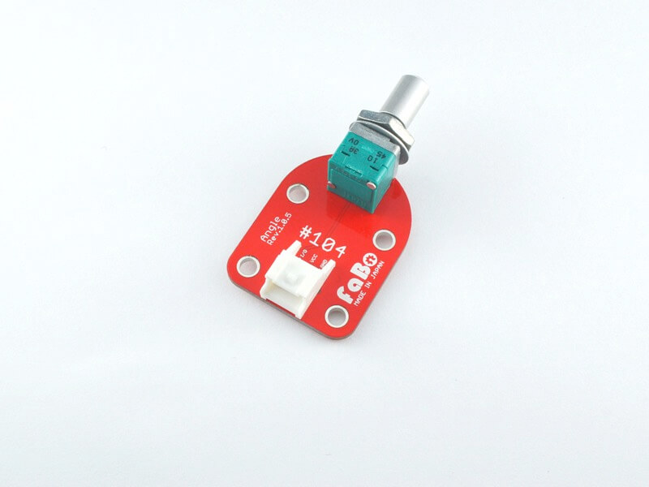

# #104 Angle Brick

<!--COLORME-->

## Overview
ボリューム抵抗を使ったBrickです。

I/Oピンからアナログ値を取得することができます。

LED Brickの明るさを調節する際などに使用します。

## Support
|Arduino|RaspberryPI|IchigoJam|
|:--:|:--:|:--:|
|◯|◯|◯|

##Schematic

## Docs

* [Arduino用サンプル](http://docs.fabo.io/fabo/arduino/brick_analog/104_brick_analog_angle.html)
* [RaspPi用サンプル](http://docs.fabo.io/fabo/rasppi/brick_analog/104_brick_analog_angle.html)
* [IchogoJam用サンプル](http://docs.fabo.io/fabo/ichigojam/brick_analog/104_brick_analog_angle.html)

## Parts
- ボリューム抵抗器A 10k

## GitHub
- https://github.com/FaBoPlatform/FaBo/tree/master/0104_angle
