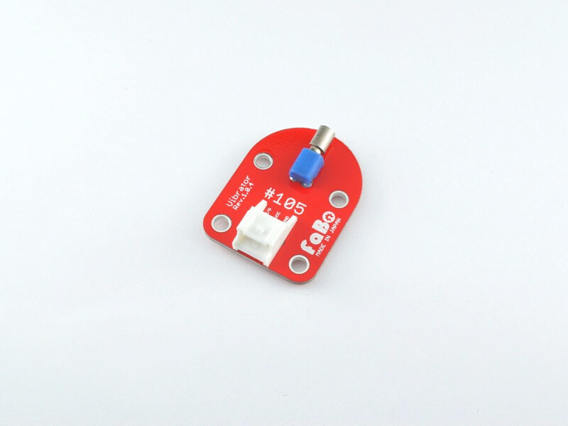

# #105 Vibrator Brick

<!--COLORME-->

## Overview
振動モーターを使用したBrickです。

I/Oピンから振動モーターのON/OFFを制御することができます。

## Support
|Arduino|RaspberryPI|IchigoJam|
|:--:|:--:|:--:|
|◯|x|x|

## Schematic

## Docs

* [Arduino用サンプル](http://docs.fabo.io/fabo/arduino/brick_analog/105_brick_analog_vibrator.html)
* [RaspPi用サンプル](http://docs.fabo.io/fabo/rasppi/brick_analog/105_brick_analog_vibrator.html)
* [IchogoJam用サンプル](http://docs.fabo.io/fabo/ichigojam/brick_analog/105_brick_analog_vibrator.html)

## Parts Specification
| Document |
|:--|
| [LA3R5-480AH1](http://akizukidenshi.com/catalog/g/gP-06744/) |

## Parts
- 振動モーター LA3R5-480AH1

## GitHub
- https://github.com/FaBoPlatform/FaBo/tree/master/0105_vibrator
