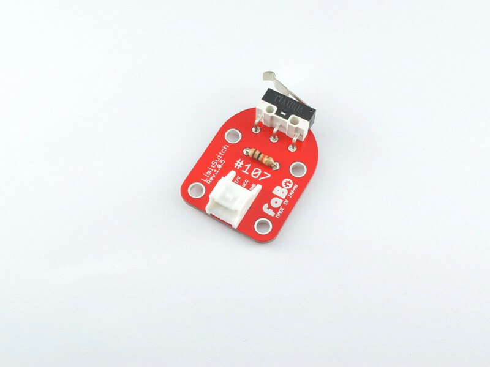

# #107 LimitSwitch Brick

<!--COLORME-->

## Overview
リミットスイッチを使ったBrickです。

I/OピンよりスイッチのON/OFFの状態を取得することができます。

機械の自動停止や位置検出の際に使用します。

## Support
|Arduino|RaspberryPI|IchigoJam|
|:--:|:--:|:--:|
|◯|◯|◯|

## Schematic

## Docs

* [Arduino用サンプル](http://docs.fabo.io/fabo/arduino/brick_analog/107_brick_analog_limitswicth.html)
* [RaspPi用サンプル](http://docs.fabo.io/fabo/rasppi/brick_analog/107_brick_analog_limitswicth.html)
* [IchogoJam用サンプル](http://docs.fabo.io/fabo/ichigojam/brick_analog/107_brick_analog_limitswicth.html)

## Parts
- リミットスイッチ

## GitHub
- https://github.com/FaBoPlatform/FaBo/tree/master/107_limitswitch
