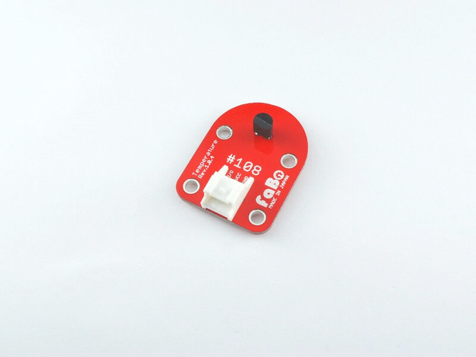

# #108 Temperature Brick

<!--COLORME-->

## Overview
温度を計測するBrickです。

アナログ値(0〜1023)を取得でき、変換することで−30度から100度までの温度を計測することができます。

## Support
|Arduino|RaspberryPI|IchigoJam|
|:--:|:--:|:--:|
|◯|◯|◯|

## Schematic

## Docs

* [Arduino用サンプル](http://docs.fabo.io/fabo/arduino/brick_analog/108_brick_analog_temperature.html)
* [RaspPi用サンプル](http://docs.fabo.io/fabo/rasppi/brick_analog/108_brick_analog_temperature.html)
* [IchogoJam用サンプル](http://docs.fabo.io/fabo/ichigojam/brick_analog/108_brick_analog_temperature.html)

## LM61CIZ Datasheet
| Document |
|:--|
| [LM61CIZ Datasheet](http://akizukidenshi.com/catalog/g/gI-02726/) |

## Parts
- IC温度センサ LM61CIZ

## GitHub
- https://github.com/FaBoPlatform/FaBo/tree/master/108_temperature
