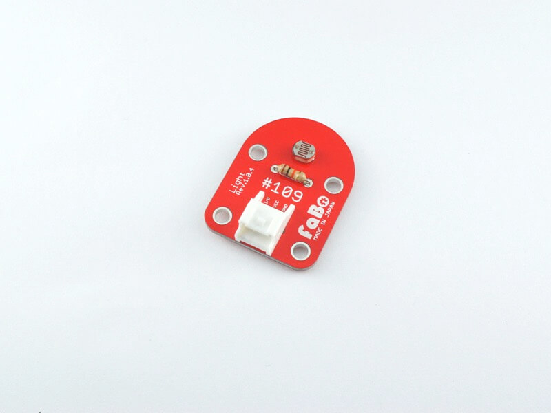

# #109 Light Brick

<!--COLORME-->

## Overview
CDSセルを使用した光センサーBrickです。

周囲の明るさの変化をアナログ値として取得することができます。

## Support
|Arduino|RaspberryPI|IchigoJam|
|:--:|:--:|:--:|
|◯|◯|◯|

## Schematic

## Docs

* [Arduino用サンプル](http://docs.fabo.io/fabo/arduino/brick_analog/109_brick_analog_ambientlight.html)
* [RaspPi用サンプル](http://docs.fabo.io/fabo/rasppi/brick_analog/109_brick_analog_ambientlight.html)
* [IchogoJam用サンプル](http://docs.fabo.io/fabo/ichigojam/brick_analog/109_brick_analog_ambientlight.html)

## Parts Specification
| Document |
|:--|
| [MI527](http://akizukidenshi.com/catalog/g/gI-00110/) |

## Parts
- CDSセル(5mm)

## GitHub
- https://github.com/FaBoPlatform/FaBo/tree/master/0109_light
