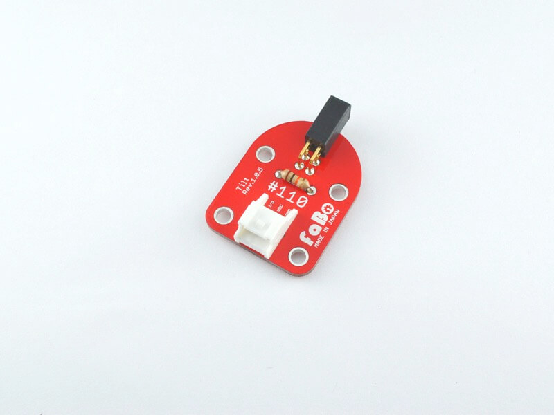
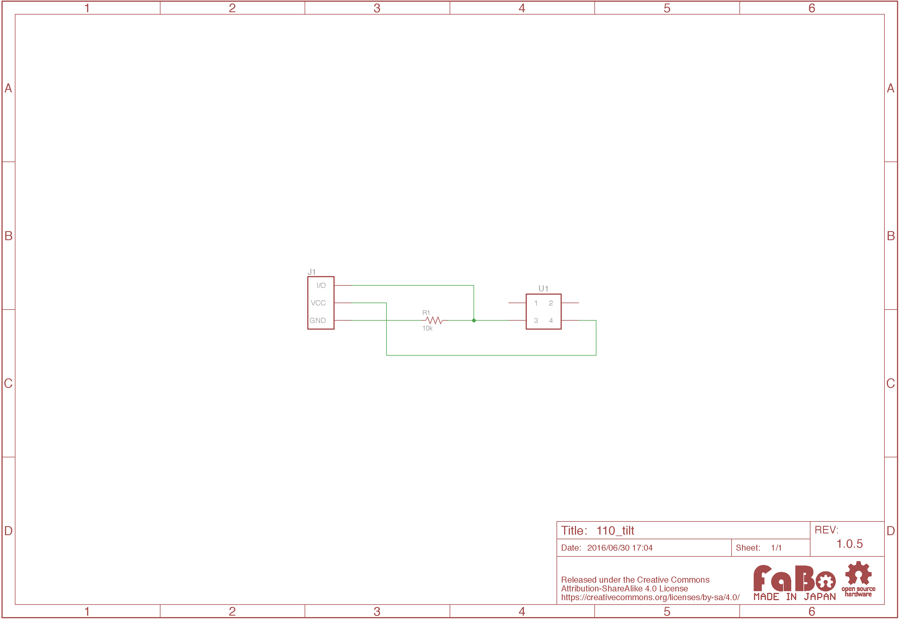

# #110 Tilt Brick

<!--COLORME-->

## Overview
傾斜センサーを使用したBrickです。

I/Oピンより傾斜センサーの状態をデジタル値(0〜1)取得することができます。

黒い部分の中に玉が入っていて傾くとデジタル値が変化します。

LED Brickを点灯/消灯させる際などに使用します。

## Support
|Arduino|RaspberryPI|IchigoJam|
|:--:|:--:|:--:|
|◯|◯|◯|

## Schematic

## Docs

* [Arduino用サンプル](http://docs.fabo.io/fabo/arduino/brick_analog/110_brick_analog_tilt.html)
* [RaspPi用サンプル](http://docs.fabo.io/fabo/rasppi/brick_analog/110_brick_analog_tilt.html)
* [IchogoJam用サンプル](http://docs.fabo.io/fabo/ichigojam/brick_analog/110_brick_analog_tilt.html)

## Parts
- 傾斜(振動)スイッチ

## GitHub
- https://github.com/FaBoPlatform/FaBo/tree/master/110_tilt
