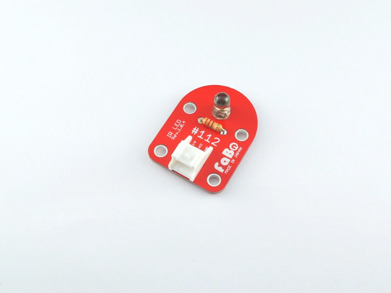
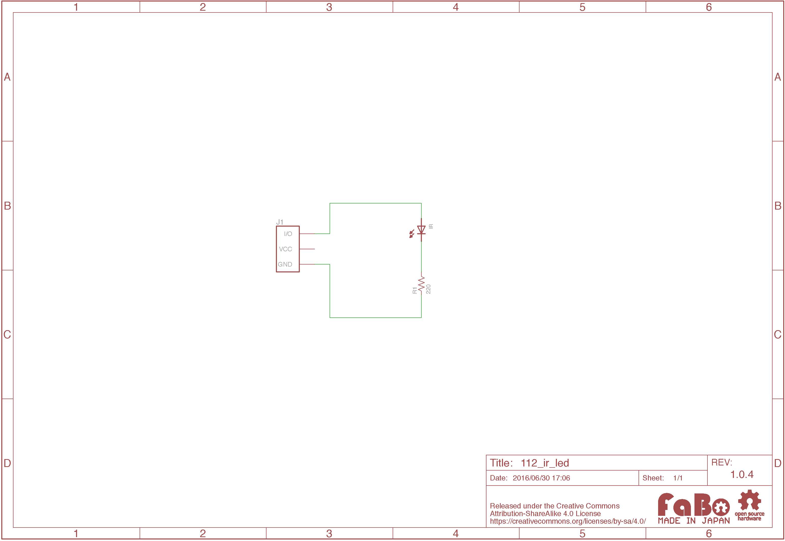

# #112 IR LED Brick

<!--COLORME-->

## Overview
赤外線LEDを使ったBrickです。

I/Oピンから赤外線LEDをON/OFFを制御することができます。

## Support
|Arduino|RaspberryPI|IchigoJam|
|:--:|:--:|:--:|
|◯|◯|◯|

## Schematic

## Parts Specification
| Document |
|:--|
| [OSI5LA5113A](http://akizukidenshi.com/catalog/g/gI-04311/) |

## Parts
- 5mm 赤外線LED OSI5LA5113A

## GitHub
- https://github.com/FaBoPlatform/FaBo/tree/master/112_ir_led
