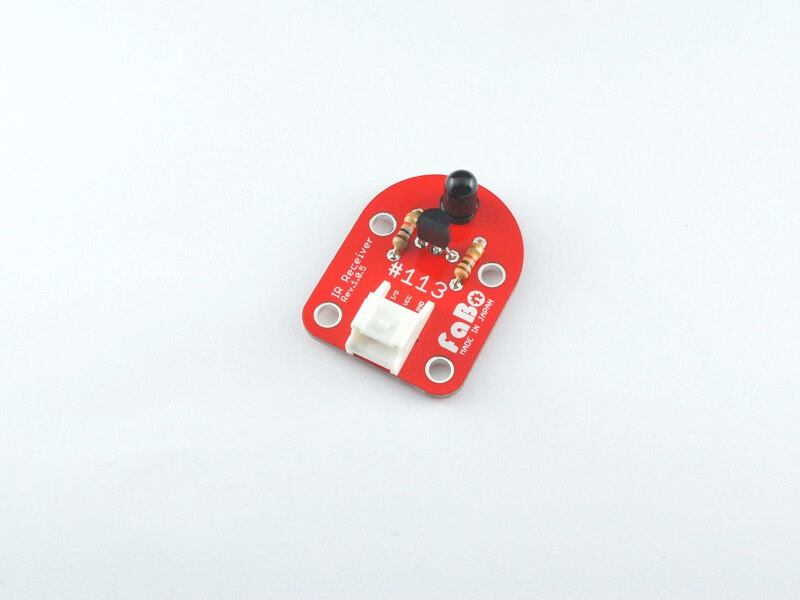

# #113 IR Receiver Brick

<!--COLORME-->

## Overview
フォトトランジスタを使った赤外線受信Brickです。

I/Oピンから赤外線受信のON/OFFを取得することができます。

## Support
|Arduino|RaspberryPI|IchigoJam|
|:--:|:--:|:--:|
|◯|◯|◯|

## Schematic

## Docs

* [Arduino用サンプル](http://docs.fabo.io/fabo/arduino/brick_analog/113_brick_analog_ir_receiver.html)
* [RaspPi用サンプル](http://docs.fabo.io/fabo/rasppi/brick_analog/113_brick_analog_ir_receiver.html)
* [IchogoJam用サンプル](http://docs.fabo.io/fabo/ichigojam/brick_analog/113_brick_analog_ir_receiver.html)

## Parts Specification
| Document |
|:--|
| [L-51ROPT1D1](http://akizukidenshi.com/catalog/g/gI-04211/) |
| [2SC1815L-Y](http://akizukidenshi.com/catalog/g/gI-06475/) |

## Parts
- 赤外線フォトトランジスタ

## GitHub
- https://github.com/FaBoPlatform/FaBo/tree/master/0113_ir_receive
