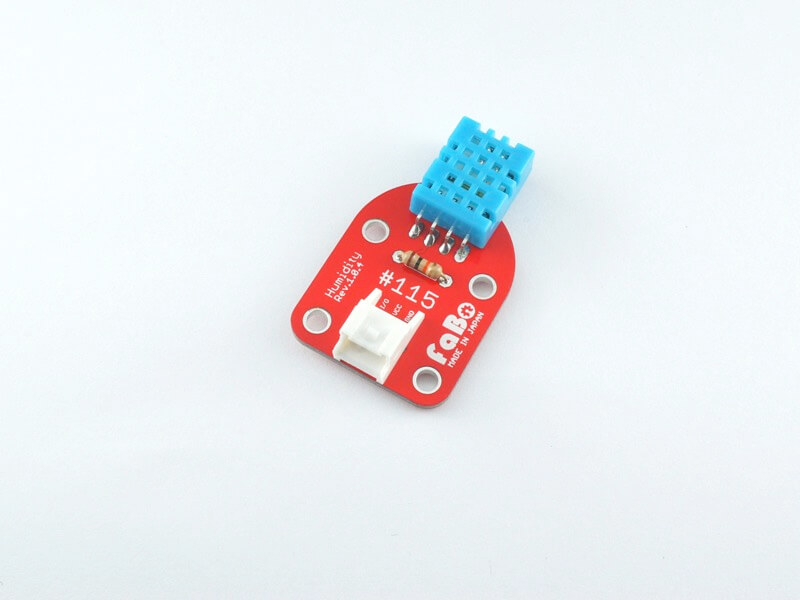

# #115 Humidity Brick

<!--COLORME-->

## Overview
湿度センサーモジュールを使用したBrickです。

温度、湿度の情報を取得することができます。

## Support
|Arduino|RaspberryPI|IchigoJam|
|:--:|:--:|:--:|
|◯|x|x|

## Schematic

## Docs

* [Arduino用サンプル](http://docs.fabo.io/fabo/arduino/brick_analog/115_brick_analog_humidity.html)
* RaspPi用サンプル (非対応)
* IchogoJam用サンプル (非対応)

## Parts Specification
| Document |
|:--|
| [DHT11](http://akizukidenshi.com/catalog/g/gM-07003/) |

## Parts
- 湿温度センサモジュールDHT11

## GitHub
- https://github.com/FaBoPlatform/FaBo/tree/master/0115_humidity
