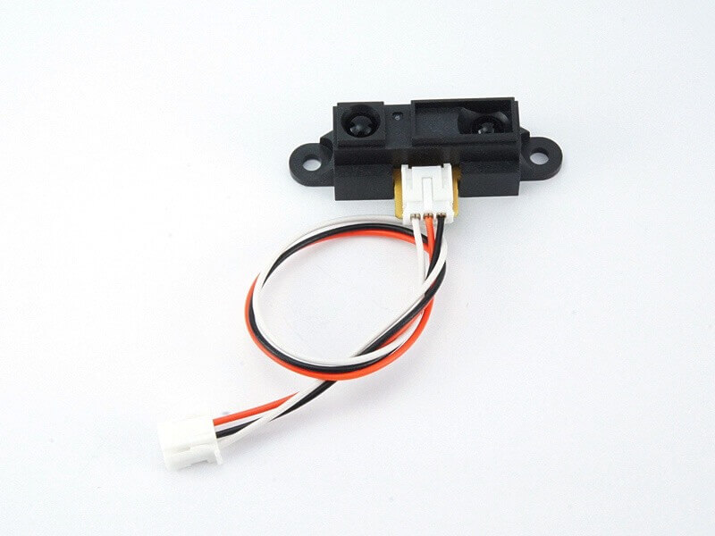

# #116 Distance Brick

<!--COLORME-->

## Overview
距離センサーモジュールを使用したBrickです。

I/Oピンより距離センサーの正面についているレンズから物体までの距離をアナログ値(0〜1023)で取得することができます。

測定可能な距離は10〜80cmとなっています。

## Support
|Arduino|RaspberryPI|IchigoJam|
|:--:|:--:|:--:|
|◯|◯|◯|

## Docs

* [Arduino用サンプル](http://docs.fabo.io/fabo/arduino/brick_analog/116_brick_analog_distance.html)
* [RaspPi用サンプル](http://docs.fabo.io/fabo/rasppi/brick_analog/116_brick_analog_distance.html)
* [IchogoJam用サンプル](http://docs.fabo.io/fabo/ichigojam/brick_analog/116_brick_analog_distance.html)

## GP2Y0A21YK Datasheet
| Document |
| -- |
| [GP2Y0A21YK Datasheet](http://www.sharpsma.com/webfm_send/1208) |

## Parts
- 距離センサーモジュール GP2Y0A21YK

## GitHub
- https://github.com/FaBoPlatform/FaBo/tree/master/116_distance
