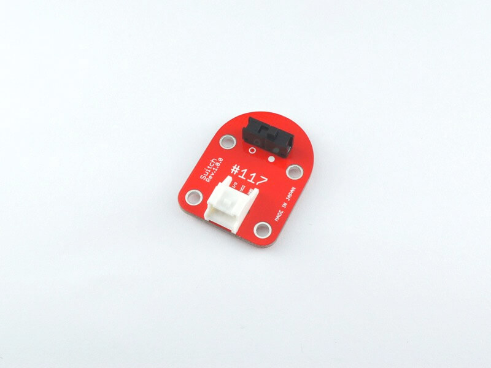
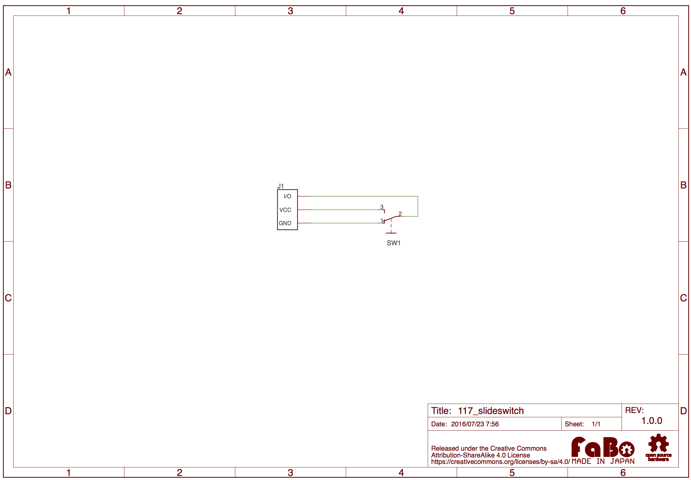

# #117 Switch Brick

<!--COLORME-->

## Overview
スライドスイッチを使用したBrickです。

I/OピンよりスライドスイッチのON/OFFをデジタル値で取得できます。

## Support
|Arduino|RaspberryPI|IchigoJam|
|:--:|:--:|:--:|
|◯|◯|◯|

## Schematic

## Parts
- スライドスイッチ

## GitHub
https://github.com/FaBoPlatform/FaBo/tree/master/0117_slideswitch
