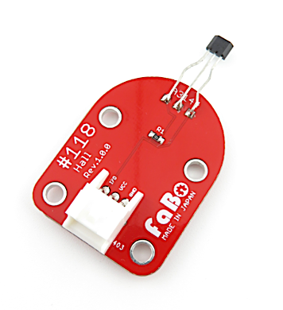
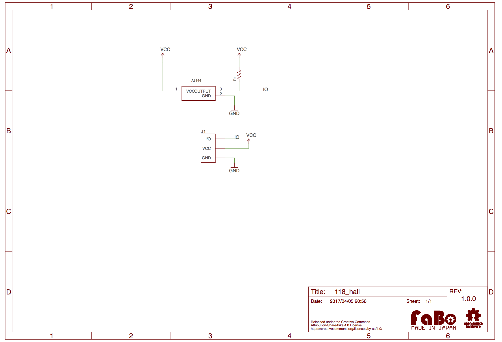

# #118 Hall Brick

<!--COLORME-->

## Overview
Hallセンサーです。

## Support
|Arduino|RaspberryPI|IchigoJam|
|:--:|:--:|:--:|
|◯|◯|◯|

## Schematic

## Docs

* [Arduino用サンプル](http://docs.fabo.io/fabo/arduino/brick_analog/118_brick_analog_hall.html)
* [RaspPi用サンプル](http://docs.fabo.io/fabo/rasppi/brick_analog/118_brick_analog_hall.html)
* [IchogoJam用サンプル](http://docs.fabo.io/fabo/ichigojam/brick_analog/118_brick_analog_hall.html)

## Parts Specification
| Document |
|:--|
| [A3144](http://www.allegromicro.com/~/media/Files/Datasheets/A3141-2-3-4-Datasheet.ashx?la=en&hash=BDFBC7C77BB7B12835643BE0F99A3490376C46BB) |

## GitHub
- https://github.com/FaBoPlatform/FaBo/tree/master/0118_hall
