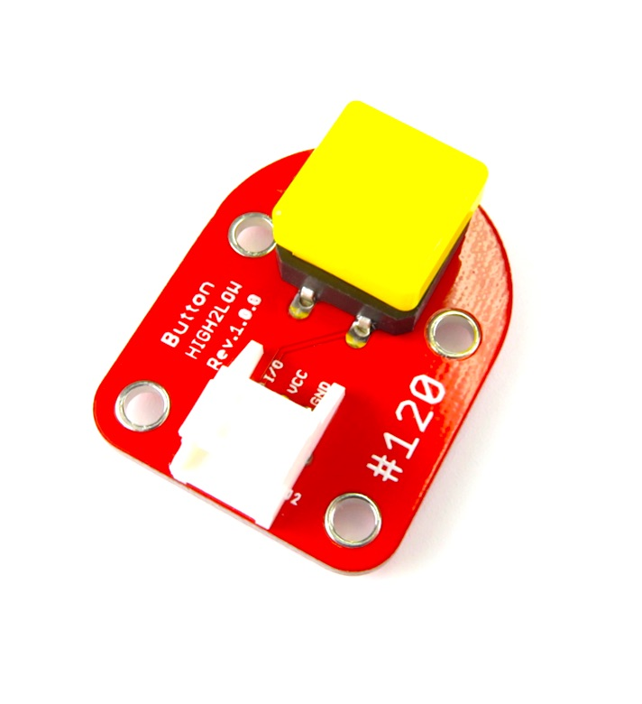
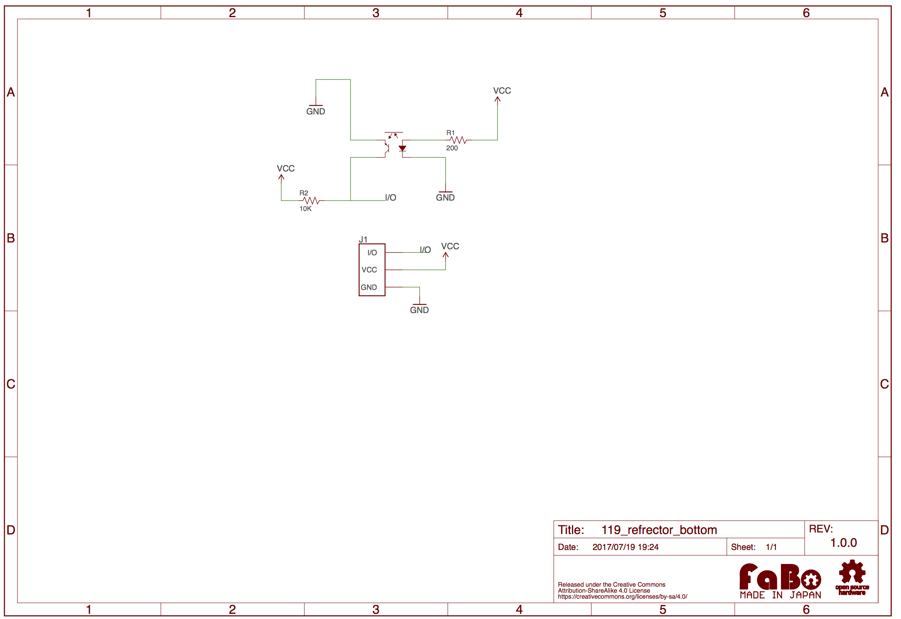

# #119 Photo Reflector Brick

<!--COLORME-->

## Overview
フォトリフレクターです。ロボットカーのライントレース等で使用できます。

## Support
|Arduino|RaspberryPI|IchigoJam|
|:--:|:--:|:--:|
|◯|◯|◯|

## Schematic

## Docs

* [Arduino用サンプル](http://docs.fabo.io/fabo/arduino/brick_analog/119_brick_analog_reflector.html) [現在作成中]
* [RaspPi用サンプル](http://docs.fabo.io/fabo/rasppi/brick_analog/119_brick_analog_reflector.html) [現在作成中]
* [IchogoJam用サンプル](http://docs.fabo.io/fabo/ichigojam/brick_analog/119_brick_analog_reflector.html) [現在作成中]

## Parts Specification
| Document |
|:--|
| LBR-127HLD |

## GitHub
- https://github.com/FaBoPlatform/FaBo/tree/master/0119_reflector
