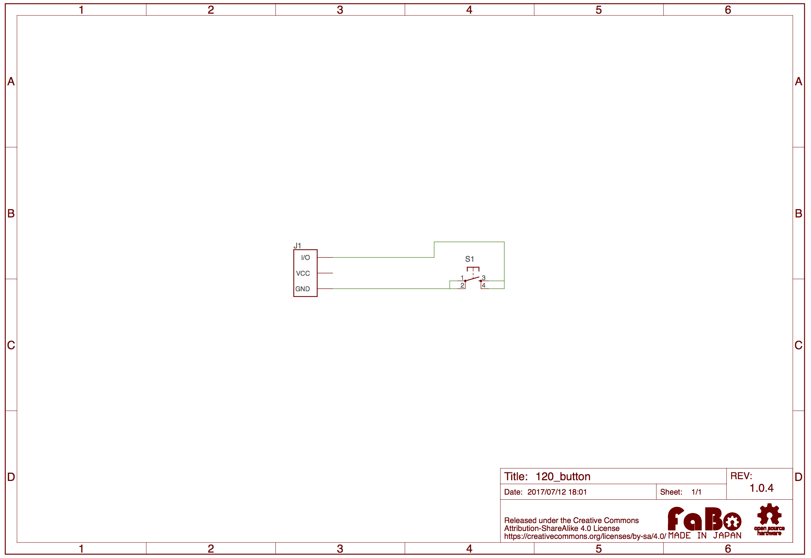

# #120 Button Brick

<!--COLORME-->

## 現在のVersion
1.0.0

## Overview
ボタンを使ったBrickです。I/OピンよりボタンのON/OFFの状態を取得することができます。
ONを押すと、I/OピンとGNDがつながります。

※ボタンカバー部分の色はランダムで送付するため色のご指定はできません。あらかじめご了承ください。

## Support
|Arduino|RaspberryPI|IchigoJam|
|:--:|:--:|:--:|
|◯|◯|◯|

## Schematic

## Docs

* [Arduino用サンプル](http://docs.fabo.io/fabo/arduino/brick_analog/120_brick_analog_button.html)
* [RaspPi用サンプル](http://docs.fabo.io/fabo/rasppi/brick_analog/120_brick_analog_button.html)
* [IchogoJam用サンプル](http://docs.fabo.io/fabo/ichigojam/brick_analog/120_brick_analog_button.html)

## Parts
- 12mm角タクトスイッチ

## Community

## GitHub
- https://github.com/FaBoPlatform/FaBo/tree/master/0120_button
