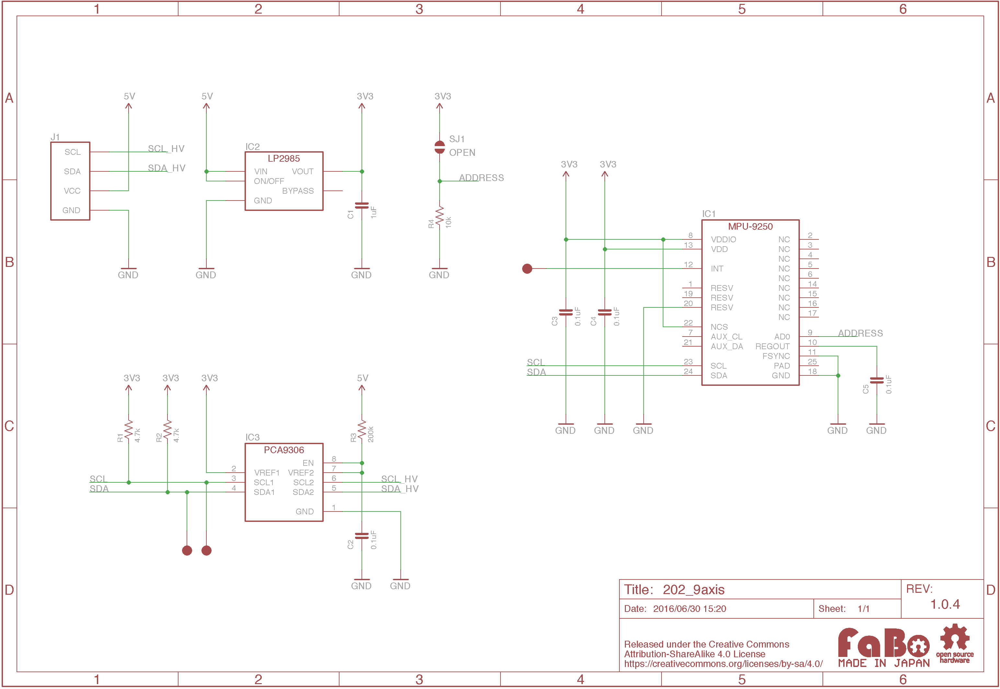

# #202 9Axis I2C Brick

<!--COLORME-->

## Overview
1チップで3軸加速度、3軸ジャイロ、3軸コンパスを取得できるセンサを使用したBrickです。

I2Cでデータを取得できます。

## Support
|Arduino|RaspberryPI|
|:--:|:--:|
|◯|◯|

## MPU-9250 Datasheet
| Document |
|:--:|
| [MPU-9250 Register Map](http://43zrtwysvxb2gf29r5o0athu.wpengine.netdna-cdn.com/wp-content/uploads/2015/02/MPU-9250-Register-Map.pdf) |
| [MPU-9250 Datasheet](http://43zrtwysvxb2gf29r5o0athu.wpengine.netdna-cdn.com/wp-content/uploads/2015/02/MPU-9250-Datasheet.pdf) |

## Register
MPU-9250は、三軸加速度、ジャイロ用とコンパス用の2つのI2C Slave Addressがあります。

### MPU-9250(三軸加速度、ジャイロ)

|Slave Address|
|:--:|
|0x68|

### AK8963(コンパス)
|Slave Address |
|:--:|
|0x0C|

## Schematic

## Docs

* [Arduino用サンプル](http://docs.fabo.io/fabo/arduino/brick_i2c/202_brick_i2c_9axis.html)
* [RaspPi用サンプル](http://docs.fabo.io/fabo/rasppi/brick_i2c/202_brick_i2c_9axis.html)
* [IchogoJam用サンプル](http://docs.fabo.io/fabo/ichigojam/brick_i2c/202_brick_i2c_9axis.html)

## Parts
- InvenSense MPU-9250

## GitHub
- https://github.com/FaBoPlatform/FaBo/tree/master/202_9axis
