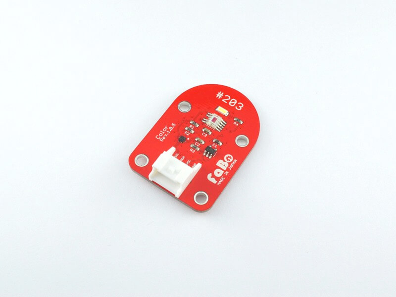
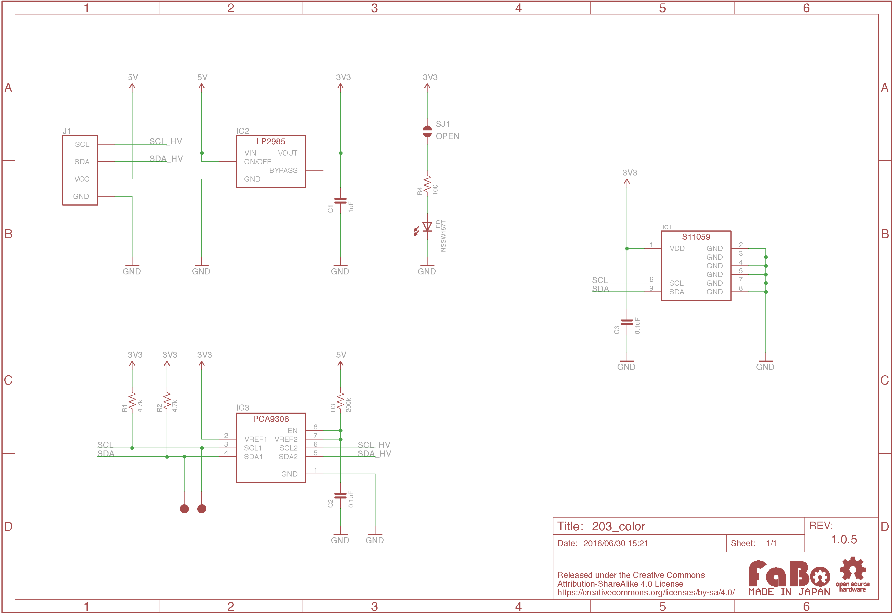

# #203 Color I2C Brick

<!--COLORME-->

## Overview
カラーセンサを使用したBrickです。

センサーより読み取った赤、緑、青、赤外線(明るさ)の4つのデータを、I2Cにて取得することができます。

## Connecting
I2Cコネクタへ接続します。

## Support
|Arduino|RaspberryPI|IchigoJam|Edison|
|:--:|:--:|:--:|:--:|
|◯|◯|◯|◯|

## S11059 Datasheet
| Document |
| -- |
| [S11059 Datasheet](http://www.hamamatsu.com/resources/pdf/ssd/s11059-02dt_etc_kpic1082j.pdf) |

## Register
| Slave Address |
| -- |
| 0x2A |

## Schematic

## Docs

* [Arduino用サンプル](http://docs.fabo.io/fabo/arduino/brick_i2c/203_brick_i2c_color.html)
* [RaspPi用サンプル](http://docs.fabo.io/fabo/rasppi/brick_i2c/203_brick_i2c_color.html)
* [IchogoJam用サンプル](http://docs.fabo.io/fabo/ichigojam/brick_i2c/203_brick_i2c_color.html)

## Parts
- HAMAMATSU S11059

## GitHub
- https://github.com/FaBoPlatform/FaBo/tree/master/203_color
