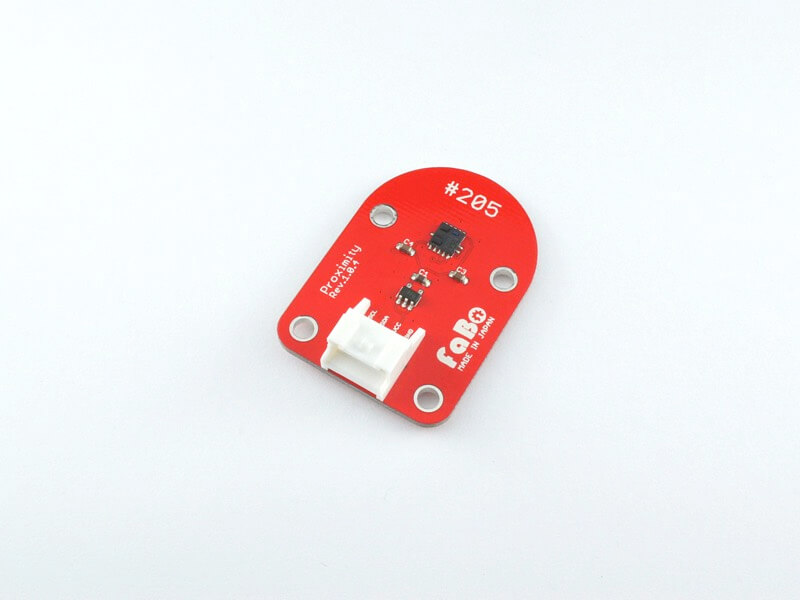
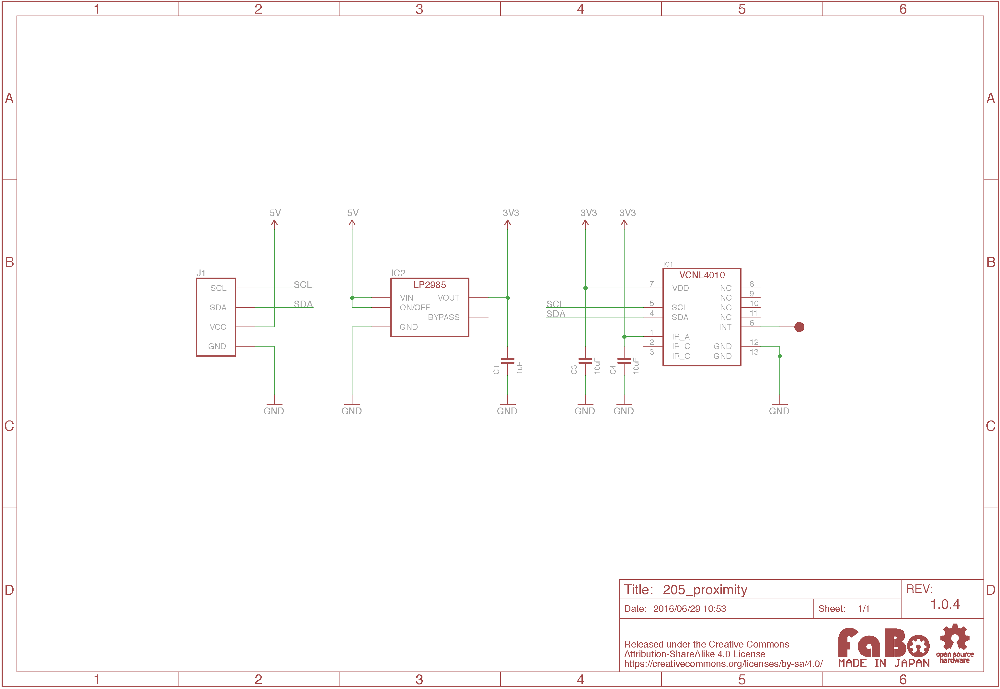

# #205 Proximity I2C Brick

<!--COLORME-->

## Overview
近接センサーを使ったBrickです。

I2Cでデータを取得できます。

## Connecting
I2Cコネクタへ接続します。

## Support
|Arduino|RaspberryPI|IchigoJam|Edison|
|:--:|:--:|:--:|:--:|
|◯|◯|◯|◯|

## VCNL4010 Datasheet
| Document |
|:--|
| [VCNL4010 Datasheet](https://www.adafruit.com/images/product-files/466/vcnl4010.pdf) |

## Register
| I2C Slave Address |
|:-- |
| 0x13 |

## Schematic

## Docs

* [Arduino用サンプル](http://docs.fabo.io/fabo/arduino/brick_i2c/205_brick_i2c_proximity.html)
* [RaspPi用サンプル](http://docs.fabo.io/fabo/rasppi/brick_i2c/205_brick_i2c_proximity.html)
* [IchogoJam用サンプル](http://docs.fabo.io/fabo/ichigojam/brick_i2c/205_brick_i2c_proximity.html)

## Parts
- Vishay VCNL4010

## GitHub
- https://github.com/FaBoPlatform/FaBo/tree/master/205_proximity
