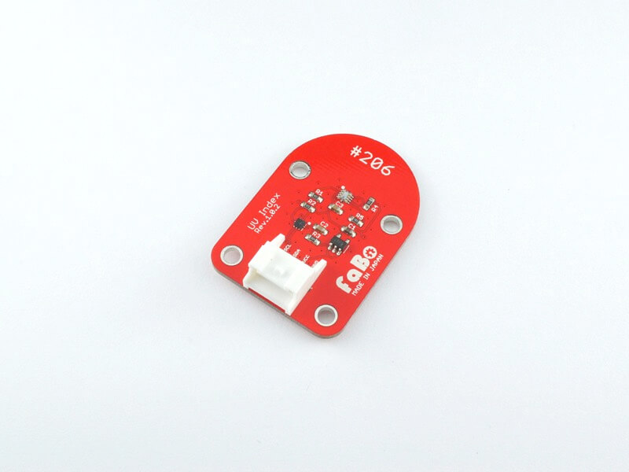

# #206 UV Index I2C Brick

<!--COLORME-->

## Overview
紫外線センサーを使ったBrickです。

I2Cでデータを取得できます。

## Si1133 Datasheet
| Document |
|:--|
| [Si1133 Datasheet](http://www.silabs.com/Support%20Documents/TechnicalDocs/Si1133.pdf) |

## Schematic

## Docs

* [Arduino用サンプル](http://docs.fabo.io/fabo/arduino/brick_i2c/206_brick_i2c_uv.html)
* [RaspPi用サンプル](http://docs.fabo.io/fabo/rasppi/brick_i2c/206_brick_i2c_uv.html)
* [IchogoJam用サンプル](http://docs.fabo.io/fabo/ichigojam/brick_i2c/206_brick_i2c_uv.html)

## Parts
- Silicon Laboratories Si1133

## GitHub
- https://github.com/FaBoPlatform/FaBo/tree/master/206_uv
