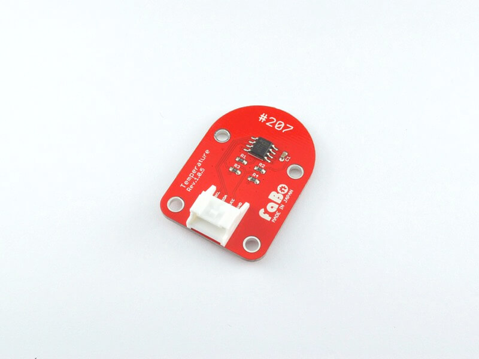
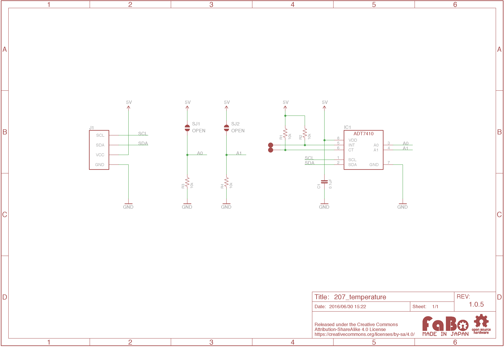

# #207 Temperature I2C Brick

<!--COLORME-->

## Overview
温度センサを使用したBrickです。
I2Cでデータを取得できます。

計測できる範囲は−55度〜150度です。

## Support

|Arduino|RaspberryPI|IchigoJam|
|:--:|:--:|:--:|
|◯|◯|◯|

## Schematic

## ADT7410 Datasheet
| Document |
| -- |
| [ADT7410 Datasheet](http://www.analog.com/media/en/technical-documentation/data-sheets/ADT7410.pdf) |

## Register
| Slave Address |
| -- |
| 0x48 |

## Docs

* [Arduino用サンプル](http://docs.fabo.io/fabo/arduino/brick_i2c/207_brick_i2c_temperature.html)
* [RaspPi用サンプル](http://docs.fabo.io/fabo/rasppi/brick_i2c/207_brick_i2c_temperature.html)
* [IchogoJam用サンプル](http://docs.fabo.io/fabo/ichigojam/brick_i2c/207_brick_i2c_temperature.html)

## Parts
- Analog Devices ADT7410

## GitHub
- https://github.com/FaBoPlatform/FaBo/tree/master/207_temperature
