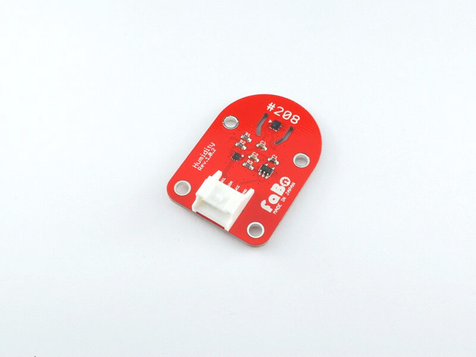
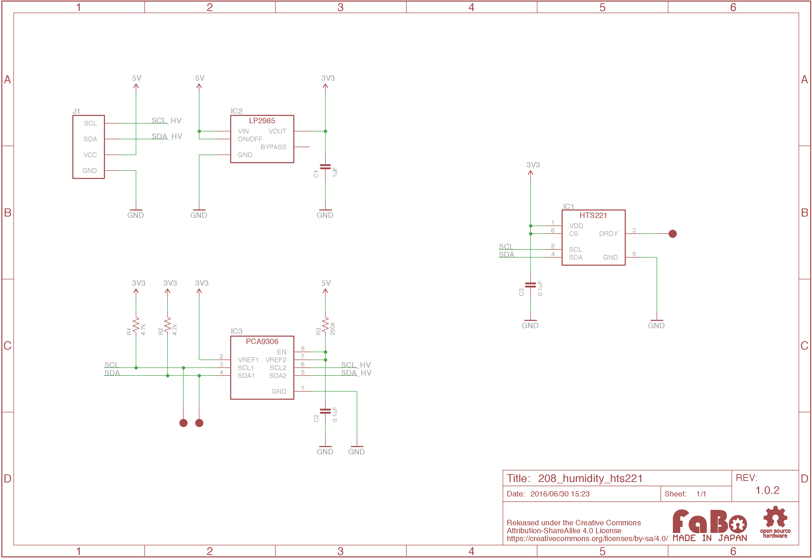

# #208 Humidity I2C Brick

<!--COLORME-->

## Overview
湿度センサを使用したBrickです。
I2Cでデータを取得できます。

## Support
|Arduino|RaspberryPI|
|:--:|:--:|
|◯|◯|

## Schematic

## HTS221 Datasheet
| Document |
| -- |
| [HTS221 Datasheet](http://www2.st.com/content/ccc/resource/technical/document/datasheet/4d/9a/9c/ad/25/07/42/34/DM00116291.pdf/files/DM00116291.pdf/jcr:content/translations/en.DM00116291.pdf) |

## Register
| Slave Address |
| -- |
| 0x5F |

## Docs

* [Arduino用サンプル](http://docs.fabo.io/fabo/arduino/brick_i2c/208_brick_i2c_humidity.html)
* [RaspPi用サンプル](http://docs.fabo.io/fabo/rasppi/brick_i2c/208_brick_i2c_humidty.html)
* [IchogoJam用サンプル](http://docs.fabo.io/fabo/ichigojam/brick_i2c/208_brick_i2c_humidity.html)

## Parts
- STMicroelectronics HTS221

## GitHub
- https://github.com/FaBoPlatform/FaBo/tree/master/208_humidity
