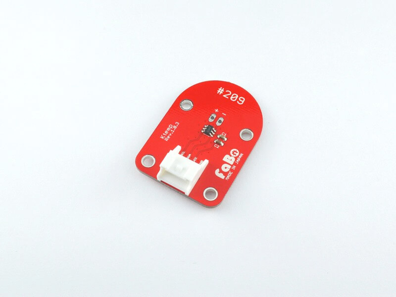

# #209 Ktemp I2C Brick

<!--COLORME-->

## Overview
K型熱電対を接続できるBrickです。
I2Cでデータを取得できます。

## Support
|Arduino|RaspberryPI|IchigoJam|
|:--:|:--:|:--:|
|◯|◯|◯|

## Schematic

## MCP3421 Datasheet
| Document |
| -- |
| [MCP3421 Datasheet](http://ww1.microchip.com/downloads/en/DeviceDoc/22003e.pdf) |

## Register
| Slave Address |
| -- |
| 0x68 - 0x6F |
MCP3421のSlave Addressは0x68〜0x6Fのものが存在し、その値は工場出荷時に決まっており、後から変更することはできません。
FaBoBrickでは、0x68、または0x69の２種類を使用しています。

## Docs

* [Arduino用サンプル](http://docs.fabo.io/fabo/arduino/brick_i2c/209_brick_i2c_ktemp.html)
* [RaspPi用サンプル](http://docs.fabo.io/fabo/rasppi/brick_i2c/209_brick_i2c_ktemp.html)
* [IchogoJam用サンプル](http://docs.fabo.io/fabo/ichigojam/brick_i2c/209_brick_i2c_ktemp.html)

## Parts
- Microchip Technology MCP3421

## GitHub
- https://github.com/FaBoPlatform/FaBo/tree/master/209_ktemp
