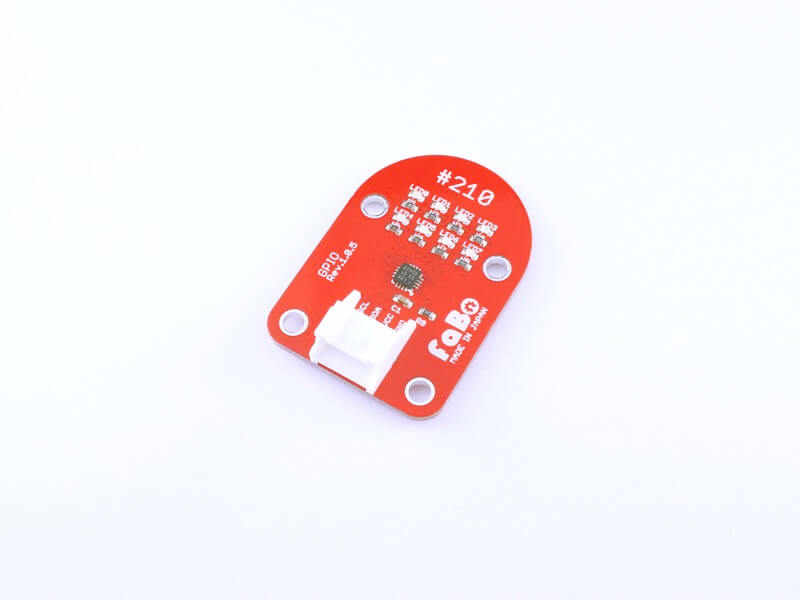

# #210 GPIO I2C Brick

<!--COLORME-->

## Overview
汎用I/O拡張チップを使用したBrickです。

I2Cで8個のLEDを制御できます。

## Support
|Arduino|RaspberryPI|IchigoJam|
|:--:|:--:|:--:|
|◯|◯|◯|

## Schematic

## PCAL6408 Datasheet
| Document |
| -- |
| [PCAL6408 Datasheet](http://www.nxp.com/documents/data_sheet/PCAL6408A.pdf) |

## Register
| Slave Address |
| -- |
| 0x20 |

## Docs

* [Arduino用サンプル](http://docs.fabo.io/fabo/arduino/brick_i2c/210_brick_i2c_gpio.html)
* [RaspPi用サンプル](http://docs.fabo.io/fabo/rasppi/brick_i2c/210_brick_i2c_gpio.html)
* [IchogoJam用サンプル](http://docs.fabo.io/fabo/ichigojam/brick_i2c/210_brick_i2c_gpio.html)

## Parts
- NXP PCAL6408

## GitHub
- https://github.com/FaBoPlatform/FaBo/tree/master/210_gpio
