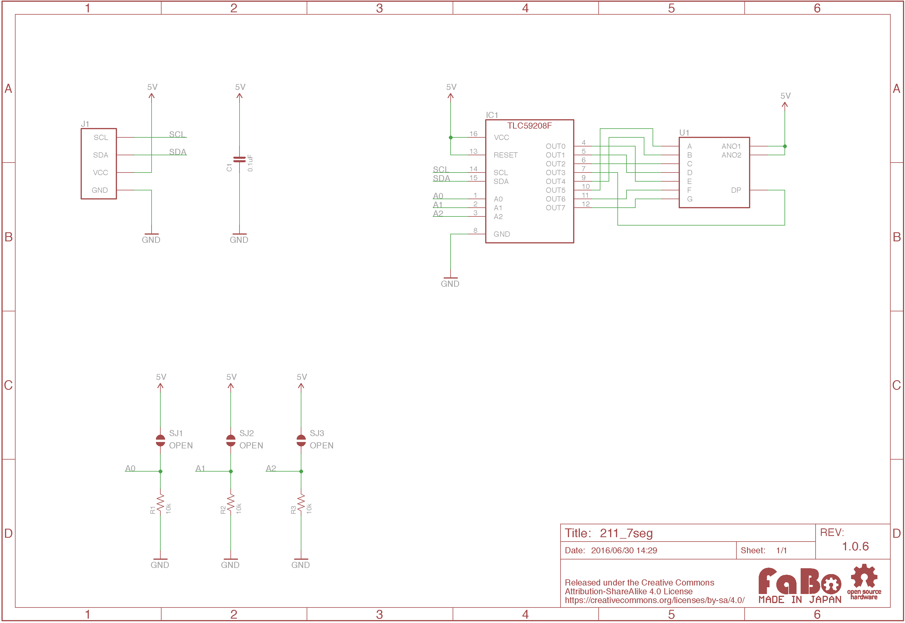

# #211 7Segment LED I2C Brick

<!--COLORME-->

## Overview
７セグメントLEDを使ったBrickです。

I2Cで表示パターンを制御できます。

## Support
|Arduino|RaspberryPI|IchigoJam|
|:--:|:--:|:--:|
|◯|◯|◯|

## Schematic

## TLC59208F Datasheet
| Document |
| -- |
| [TLC59208F Datasheet](http://www.ti.com/jp/lit/gpn/tlc59208f) |

## Register
| A0 | A1 | A2 | Slave Address |
| -- | -- | -- | -- |
| LOW | LOW | LOW | 0x20 |

FaBo Brickでは、初期値に0x20が設定されています。Brick裏面のソルダージャンパーで設定を変更できます。

## Docs

* [Arduino用サンプル](http://docs.fabo.io/fabo/arduino/brick_i2c/211_brick_i2c_7seg.html)
* [RaspPi用サンプル](http://docs.fabo.io/fabo/rasppi/brick_i2c/211_brick_i2c_7seg.html)
* [IchogoJam用サンプル](http://docs.fabo.io/fabo/ichigojam/brick_i2c/211_brick_i2c_7seg.html)

## Parts
- 7セグメントLED
- Texas Instruments TLC59208F

## GitHub
- https://github.com/FaBoPlatform/FaBo/tree/master/211_7seg
