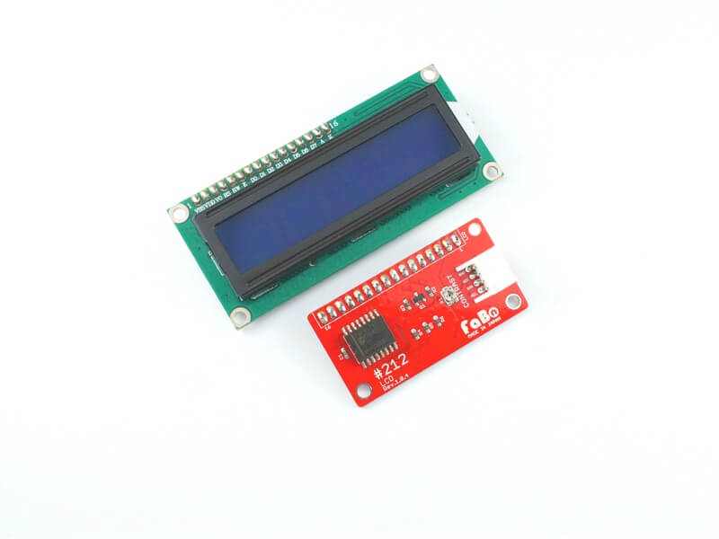

# #212 LCD I2C Brick

<!--COLORME-->

## Overview
LCDを使用したBrickです。

I2Cで表示データを制御できます。

## Support
|Arduino|RaspberryPI|
|:--:|:--:|
|◯|◯|

## Schematic

## PCF8574 Datasheet
| Document |
|:--|
| [PCF8574 Datasheet](http://www.tij.co.jp/jp/lit/ds/symlink/pcf8574.pdf) |

## Register
| A0 | A1 | A2 | Slave Address |
| -- | -- | -- | -- |
| LOW | LOW | LOW | 0x20 |

FaBo Brickでは、初期値に0x20が設定されています。Brick表面のソルダージャンパーで設定を変更できます。

## Docs

* [Arduino用サンプル](http://docs.fabo.io/fabo/arduino/brick_i2c/212_brick_i2c_lcd.html)
* [RaspPi用サンプル](http://docs.fabo.io/fabo/rasppi/brick_i2c/212_brick_i2c_lcd.html)
* [IchogoJam用サンプル](http://docs.fabo.io/fabo/ichigojam/brick_i2c/212_brick_i2c_lcd.html)

## Parts
- PCF8574
- LCD 1602A

## GitHub
- https://github.com/FaBoPlatform/FaBo/tree/master/212_lcd
