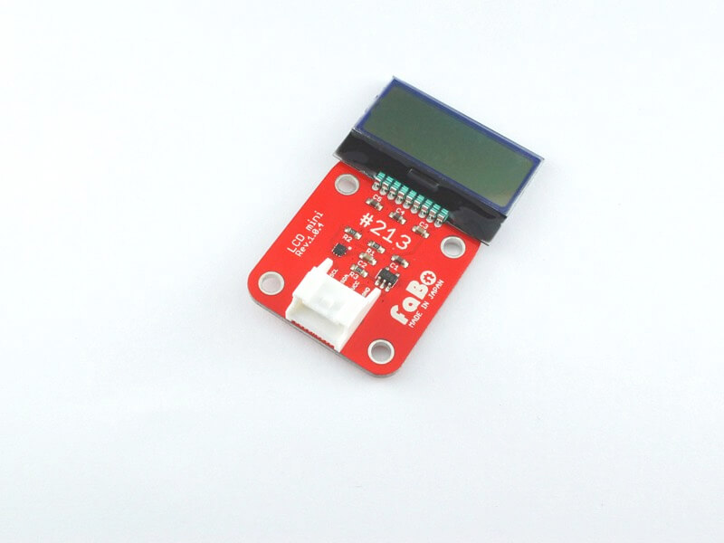

# #213 LCD mini I2C Brick

<!--COLORME-->

## Overview
8桁×2行の小さいLCDを使用したBrickです。

I2Cで表示データを制御できます。

## Support
|Arduino|IchigoJam|
|:--:|:--:|
|◯|◯|

## AQM0802A Datasheet
| Document |
| -- |
| [AQM0802A Datasheet](http://akizukidenshi.com/catalog/g/gP-06669/) |

## Register
| I2C Slave Address |
|:-- |
| 0x3E |

## Schematic

## Docs

* [Arduino用サンプル](http://docs.fabo.io/fabo/arduino/brick_i2c/213_brick_i2c_lcdmini.html)
* [RaspPi用サンプル](http://docs.fabo.io/fabo/rasppi/brick_i2c/213_brick_i2c_lcdmini.html)
* [IchogoJam用サンプル](http://docs.fabo.io/fabo/ichigojam/brick_i2c/213_brick_i2c_lcdmini.html)

## Parts
- AQM0802A

## GitHub
- https://github.com/FaBoPlatform/FaBo/tree/master/213_lcd_mini
