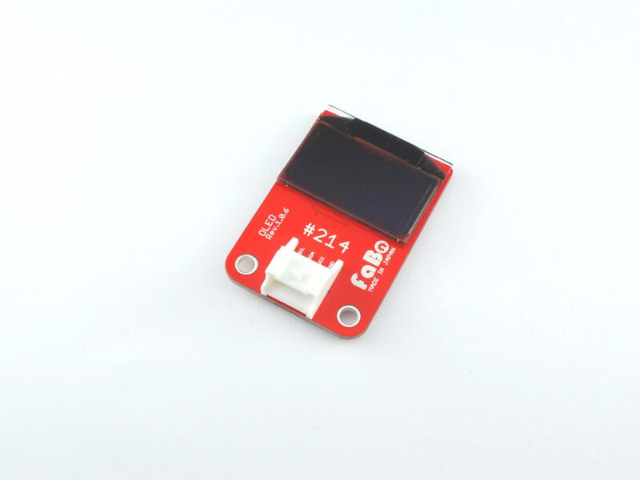

# #214 OLED I2C Brick

<!--COLORME-->

## Overview
有機ELモジュールを使用したBrickです。

I2Cで表示データを制御できます。

## Support
|Arduino|RaspberryPI|IchigoJam|
|:--:|:--:|:--:|
|◯|◯|◯|

## ER-OLED0.96 Datasheet
| Document |
| -- |
| [ER-OLED0.96 Datasheet](http://www.buydisplay.com/download/manual/ER-OLED0.96_Series_Datasheet.pdf) |

## Register
| Slave Address |
| -- |
| 0x3C |

## Schematic

## Docs

* [Arduino用サンプル](http://docs.fabo.io/fabo/arduino/brick_i2c/214_brick_i2c_oled.html)
* [RaspPi用サンプル](http://docs.fabo.io/fabo/rasppi/brick_i2c/214_brick_i2c_oled.html)
* [IchogoJam用サンプル](http://docs.fabo.io/fabo/ichigojam/brick_i2c/214_brick_i2c_oled.html)

## Parts
- 128x96 0.96OLED Module

## GitHub
- https://github.com/FaBoPlatform/FaBo/tree/master/214_oled
