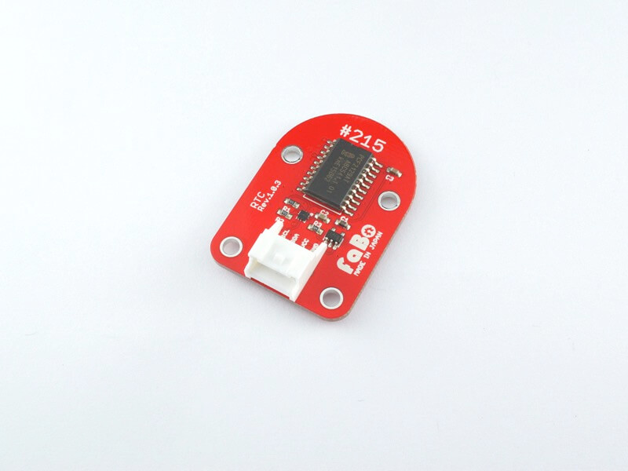
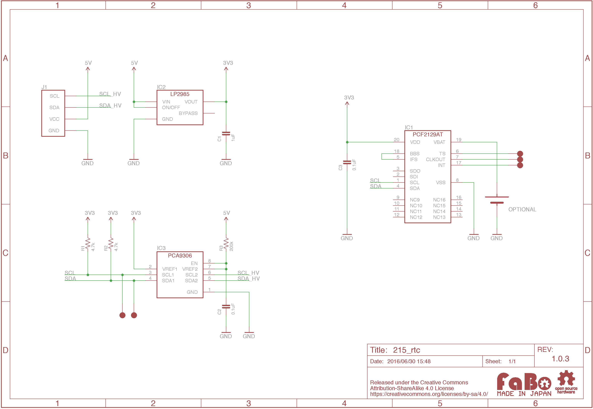

# #215 RTC I2C Brick

<!--COLORME-->

## Overview
リアルタイムクロックを使用したBrickです。
I2Cでデータを取得できます。

## Support
|Arduino|RaspberryPI|IchigoJam|
|:--:|:--:|:--:|
|◯|◯|◯|

## PCF2129 Datasheet
| Document |
| -- |
| [PCF2129 Datasheet](http://cache.nxp.com/documents/data_sheet/PCF2129.pdf) |

## Register
| Slave Address |
| -- |
| 0x51 |

## Schematic

## Docs

* [Arduino用サンプル](http://docs.fabo.io/fabo/arduino/brick_i2c/215_brick_i2c_rtc.html)
* [RaspPi用サンプル](http://docs.fabo.io/fabo/rasppi/brick_i2c/215_brick_i2c_rtc.html)
* [IchogoJam用サンプル](http://docs.fabo.io/fabo/ichigojam/brick_i2c/215_brick_i2c_rtc.html)

## Parts
- NXP PCF2129

## GitHub
- https://github.com/FaBoPlatform/FaBo/tree/master/215_rtc
