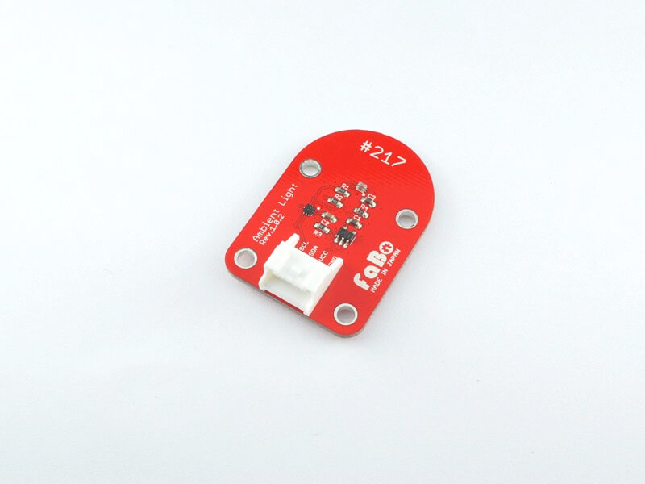

# #217 Ambient Light I2C Brick

<!--COLORME-->

## Overview
照度センサーを使ったBrickです。

I2Cで明るさを取得することができます。

## Support
|Arduino|RaspberryPI|IchigoJam|
|:--:|:--:|:--:|
|◯|◯|◯|

## Schematic

## ISL29034 Datasheet
| Document |
| -- |
| [ISL29034 Datasheet](http://www.intersil.com/content/dam/Intersil/documents/isl2/isl29034.pdf) |

## Register
| Slave Address |
| -- |
| 0x44 |

## Docs

* [Arduino用サンプル](http://docs.fabo.io/fabo/arduino/brick_i2c/217_brick_i2c_ambientlight.html)
* [RaspPi用サンプル](http://docs.fabo.io/fabo/rasppi/brick_i2c/217_brick_i2c_ambientlight.html)
* [IchogoJam用サンプル](http://docs.fabo.io/fabo/ichigojam/brick_i2c/217_brick_i2c_ambientlight.html)

## Parts
- Intersil ISL29034

## GitHub
- https://github.com/FaBoPlatform/FaBo/tree/master/217_ambientlight
