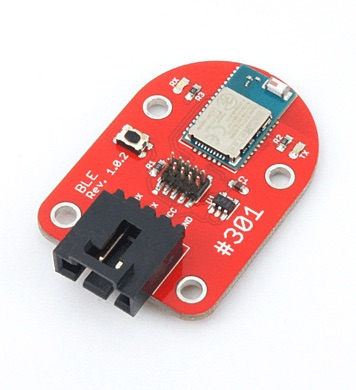

# #301 BLE SiliconLabs Serial Brick

<!--COLORME-->

## Overview

SiliconLabs BLE113を使用したBLE（Bluetooth Low Energy）のBrickです。
シリアルから、コマンドで制御して操作します。

## Support

|Arduino|RaspberryPI|IchigoJam|
|:--:|:--:|:--:|
|◯|◯|×|

## Schematic

## BLE113 Datasheet

|Document|
|--|
|[BLE113 Datasheet](http://www.mouser.com/catalog/specsheets/Bluegiga_Technologies_BLE113_Datasheet.pdf)|

## Docs

* [Arduino用サンプル](http://docs.fabo.io/fabo/arduino/brick_serial/301_brick_serial_ble.html)
* [RaspPi用サンプル](http://docs.fabo.io/fabo/rasppi/brick_serial/301_brick_serial_ble.html)
* [IchogoJam用サンプル](http://docs.fabo.io/fabo/ichigojam/brick_serial/301_brick_serial_ble.html)

## Parts
- SiliconLabs BLE113 BluetoothLE ModuleIC

## GitHub
- https://github.com/FaBoPlatform/FaBo/tree/master/301_ble_siliconlabs
