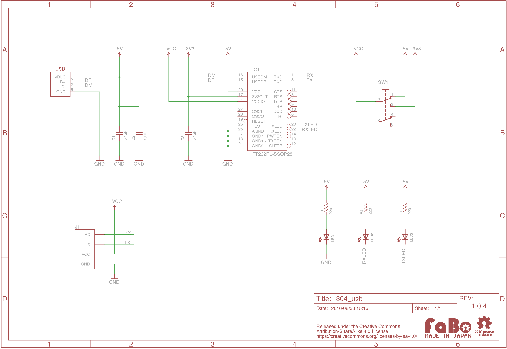

# #304 USB Serial Brick

![]

(./img/304_usb_serial.jpg)
<!--COLORME-->

## Overview
FT232RLを使用した、USBシリアル通信ができるBrickです。

## Support
|Arduino|RaspberryPI|IchigoJam|
|:--:|:--:|:--:|
|◯|◯|◯|

## FT232RL Datasheet
|Document|
|--|
|[FT232RL Datasheet](http://www.ftdichip.com/Support/Documents/DataSheets/ICs/DS_FT232R.pdf)|

## Schematic

## Parts
- USB UART IC

## GitHub
- https://github.com/FaBoPlatform/FaBo/tree/master/304_usb
