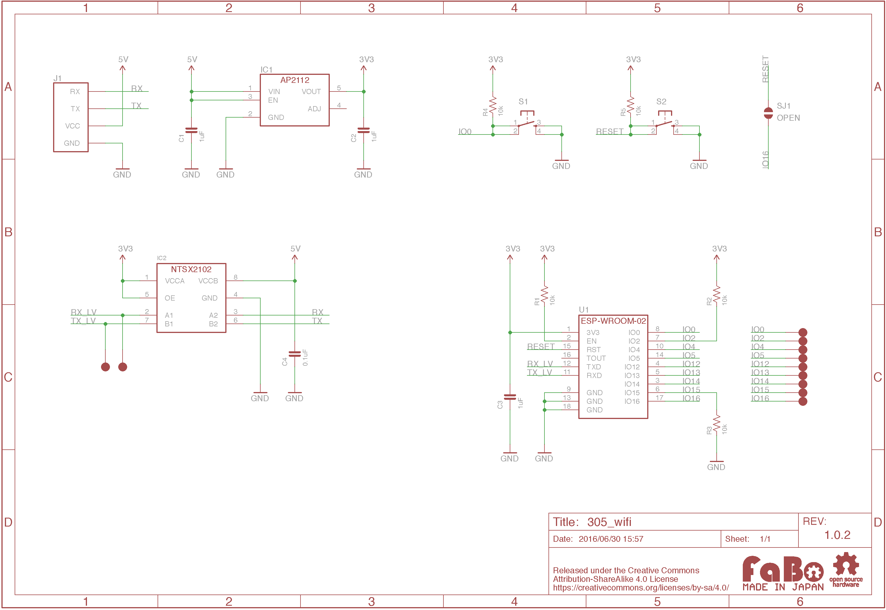

# #305 Wifi Serial Brick

<!--COLORME-->

## Overview
Wifi通信ができるBrickです。TCPクライアントやアクセスポイント、HTTPサーバになることができます。他にもWifiBrick間で１対１で接続ができます。また、マイコン搭載によりWifiBrickだけでUNOより高性能なArduinoとして単体で活用いただけます。使用できるWifi規格はIEEE 802.11 b/g/nとなっております。

技適マークがありますので安心して日本国内で使用できます。

## Support
|Arduino|
|:--:|
|◯|

## Schematic

## ESP-WROOM-02 Datasheet
|Document|
|--|
|[ESP-WROOM-02 Datasheet Page](https://espressif.com/en/products/hardware/esp-wroom-02/resources)|

##ATコマンドとは？
ATコマンドは、電話回線（モデム）に対して制御するのに開発され、現在でも使われております。WiFiBrickには、あらかじめファームウェアがインストール済みで、ATコマンドの文字列の信号をこのBrickに送信することにより命令ができるようになっています。

## ATコマンド（構文）

|  |コマンド名  |
| -- | -- |
| コマンドを実行する  |AT+コマンド  |
| コマンドの内容表示 | AT+コマンド? |
| コマンド実行引数 | AT+コマンド=引数 |

## ATコマンド（基本コマンド）

|  |コマンド名  | レスポンス |
| -- | -- | -- |
| テスト | AT | OK |
| リセット | AT+RST | Ready |
| ファームウェアのバーション表示 | AT+GMR | バーション表示 |
| コマンドエコー設定 | ATE1 | OK |
| UART通信設定 | AT+UART_DEF=通信速度（９６００bps）,データビット（８ビット）,ストップビット（１）,パリティビット(０),フロー制御（０） | -- |
| TX Power設定 | AT+RFPOWER | -- |
| スリープモード設定 | AT+SLEEP | -- |
| 工場設定 | AT+RESTORE | -- |

## ATコマンド(Wifiコマンド）

|  |コマンド名  | 正常レスポンス |
| -- | -- | -- |
| Wifiの設定 | AT+CWMODE | 1:ステーション(STA) 子機2:アクセスポイント親機3:ステーション、アクセスポイント  例 AT+CWMODE=1|
| アクセスポイント一覧 | AT+CWLAP | SSID名,電波強度,Macアドレス,0:キーなし 2:WPA 3:WPA2  4:WPA_WPA2  |
| アクセスポイントに接続| AT+CWJAP="SSID名","パスワード" | WIFI CONNECTED |
| アクセスポイントの切断| AT+CWQAP |WIF IDISCONNECTED|
| アクセスポイントの設定| AT+CWSAP |AT+CWSAP=SSID名,６４バイトまでのパスワード,チャンネル,暗号(0:オープン2:WPA_PSK 3:WPA2_PSK 4:WPA_WPA2_PSK)|
| アクセスポイントの確認| AT+CWSAP? |---|

## ATコマンド(IPコマンド）

|  |コマンド名  | 正常レスポンス |
| -- | -- | -- |
| IPアドレスの確認 | AT+CIFSR | +CIFSR:STAIP,"IPアドレス"　+CIFSR:STAMAC,"Macアドレス"|
| TCPまたは、UDP接続開始 | AT+CIPSTART="プロトコル名","URL",ポート数 | CONNECT OK|
| 転送設定 | AT+CIPMODE=数字 |AT+CIPMODE=0　非透過モード　AT+CIPMODE=1 透過モード（トランスペアレントモード）|
| データ送信（１）　| AT+CIPSEND=転送接続ID,バイト数(2048バイトまで)|---|
| データ送信（２）　| AT+CIPSEND=バイト数(2048バイトまで)|---|
| データ送信（３）　| AT+CIPSEND |OK　＞　が表示される　参考：データ送信後、+++入力で終了|
| ファームウェア更新 | AT+CIUPDATE |---|
| IP,IPDの表示 | AT+CIPDINFO |---|
| コネクション設定 | AT+CIPMUX=数字 |0:シングル接続 1:多重接続（最大４まで）|
| コネクション設定確認 | AT+CIPMUX? |----|
| サーバの設定 | AT+CIPSERVER=モード数字、ポート数字 |モード 0:サーバー削除、1:サーバー作成　ポート　デフォルト３３３|

## Parts
- ESP-WROOM-02
