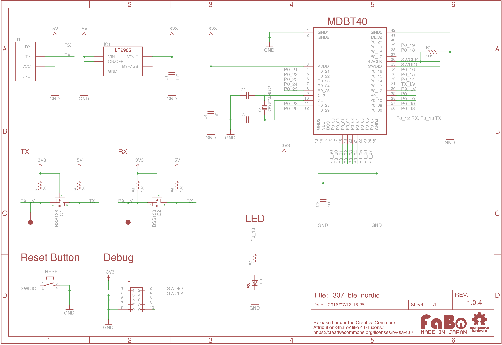

# #307 BLE Nordic Serial Brick

<!--COLORME-->

## Overview
NRF51モジュールを使用したBLE（Bluetooth Low Energy）のBrickです。

シリアルにて制御できるFirmwareが書き込まれているため、Arduino等からシリアル通信にてBLEを制御することができます。

BLEの転送レートは115200bpsに設定してあります。

## Support
|Arduino|RaspberryPI|
|:--:|:--:|
|◯|◯|

## Schematic

## MDBT40 Datasheet

|Document|
|--|
|[MDBT40 Datasheet](http://www.raytac.com/download/MDBT40/MDBT40%20spec-Version%20A4.pdf)|

## Parts
- raytac MDBT40

## GitHub
- https://github.com/FaBoPlatform/FaBo/tree/master/307_ble_nordic
