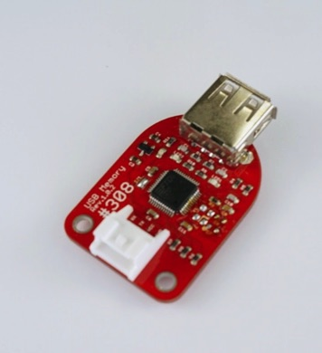
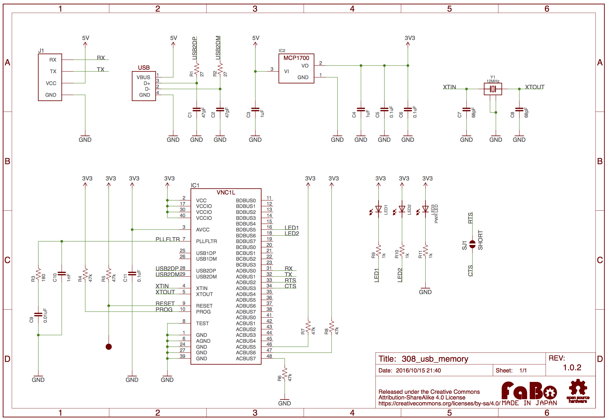

# #308 USB Memory Serial Brick

<!--COLORME-->

## Overview
USB Mass Storageプロトコルに対応したBrickです。USB Memoryへの読み込み、書き込みが可能になります。

## Support
|Arduino|RaspberryPI|IchigoJam|
|:--:|:--:|:--:|
|◯|◯|△|

## Schematic

##  Datasheet

|Document|
|--|
|[VNC1L](http://www.ftdichip.com/Support/Documents/DataSheets/ICs/DS_VNC1L.pdf)|

## Parts
- VNC1L

## GitHub
- https://github.com/FaBoPlatform/FaBo/tree/master/308_usb_memory
