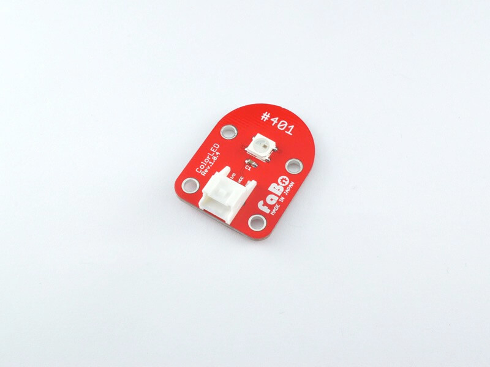
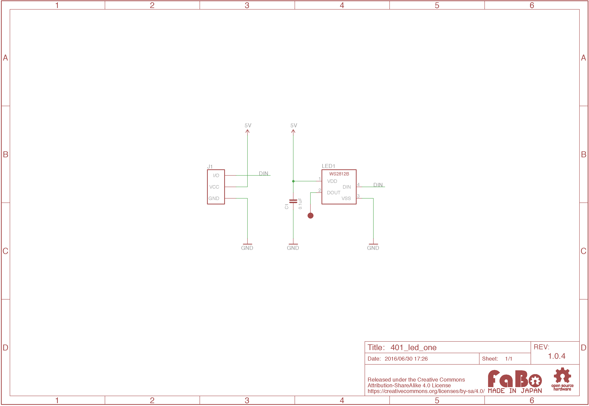

# #401 ColorLED One

<!--COLORME-->

## Overview
RGB Color LEDを使ったBrickです。

## Support
|Arduino|RaspberryPI|
|:--:|:--:|
|◯|◯|

## Schematic

## WS2812B Datasheet
|Document|
|--|
|[WS2812B Datasheet](http://www.adafruit.com/datasheets/WS2812B.pdf)|

## Parts
- RGB LED WS2812B

## GitHub
- https://github.com/FaBoPlatform/FaBo/tree/master/401_led
