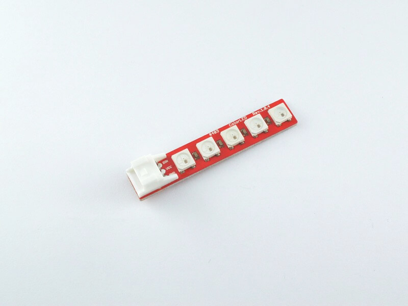

# #403 ColorLED Bar

<!--COLORME-->

## Overview
RGB Color LEDをBar状に5個配置したBrickです。

## Support
|Arduino|RaspberryPI|
|:--:|:--:|
|◯|◯|

## WS2812B Datasheet
|Document|
|--|
|[WS2812B Datasheet](http://www.adafruit.com/datasheets/WS2812B.pdf)|

## Schematic

## Parts
- RGB LED WS2812B

## GitHub
- https://github.com/FaBoPlatform/FaBo/tree/master/403_led_bar

