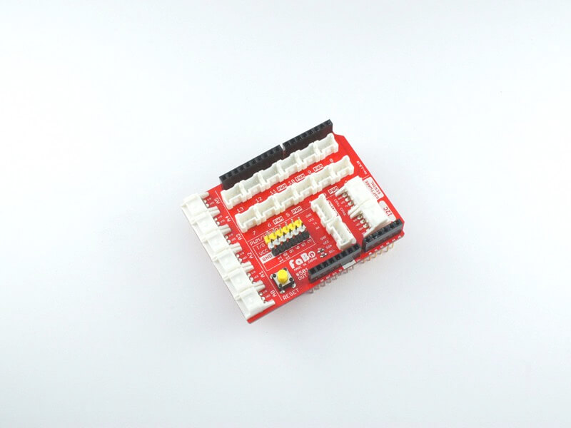
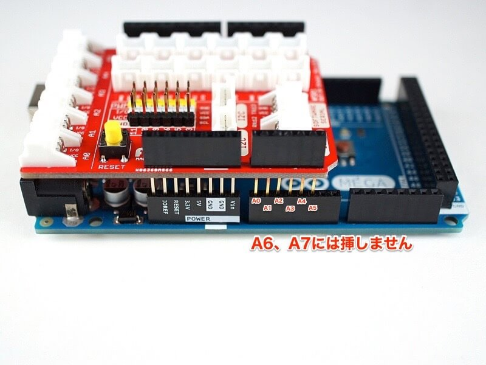

# #501 OUT/IN Shield for Arduino

  

<!--COLORME-->

## Overview
OUT/IN Shield for Arduinoは、Arduinoと各種センサーやボタンをケーブルを1本接続するだけで使えるArduino対応シールドです。

Arduino本体、およびArduino UNOケースは含まれません。別途、お買い求めください。

### アナログコネクタ(3pin)
- A0
- A1
- A2
- A3
- A4
- A5

### デジタルコネクタ(3pin)
- D2
- D3(PWM対応)
- D4
- D5(PWM対応)
- D6(PWM対応)
- D7
- D8
- D9(PWM対応)
- D10(PWM対応)
- D11(PWM対応)
- D12
- D13

### PWM/Servoコネクタ(3pin)
- サーボモータ接続用コネクタ(2.54mmピッチピンヘッダ)

PWMに対応するD3,D5,D6,D9,D10,D11

### ハードウェアシリアルコネクタ(4pin)
- D0/D1がRX/TXに接続されたシリアルBrick用コネクタ

※Arduinoへの書き込み時は、このコネクタからケーブルを外してください。

### ソフトウェアシリアルコネクタ(4pin)
SoftwareSerialとして使用するため、RX,TXはそれぞれ、D12,D13になります。

### I2Cコネクタ(4pin)
Arduino MEGAではR3以降から対応になります。
Arduino UNO R3/R2では使用可能です。

シールド裏面に、I2Cプルアップ抵抗切り離し用のソルダージャンパーがあります。

デフォルトではショートされていますので、I2Cプルアップ抵抗が不要な場合、カッター等でパターンを切り離してください。

## OUT/INシールド接続方法

### Arduino UNO

#### USBコネクタを右側に向けたとき

左端をDIGITAL0ピン、右端をSCLピンに挿します。

#### USBコネクタを左側に向けたとき

左端をRESERVEDピン、右端をA5ピンに挿します。

### Arduino MEGA

#### USBコネクタを右側に向けたとき

左端をDIGITAL0ピン、右端をSCLピンに挿します。

#### USBコネクタを左側に向けたとき

左端をRESERVEDピン、右端をA5ピンに挿します。A6、A7には挿しません。

## Schematic

## GitHub
- https://github.com/FaBoPlatform/FaBo/tree/master/501_outin_arduino
