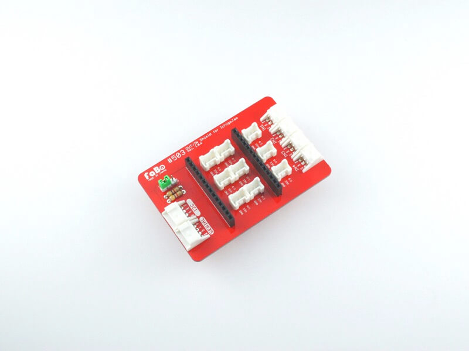
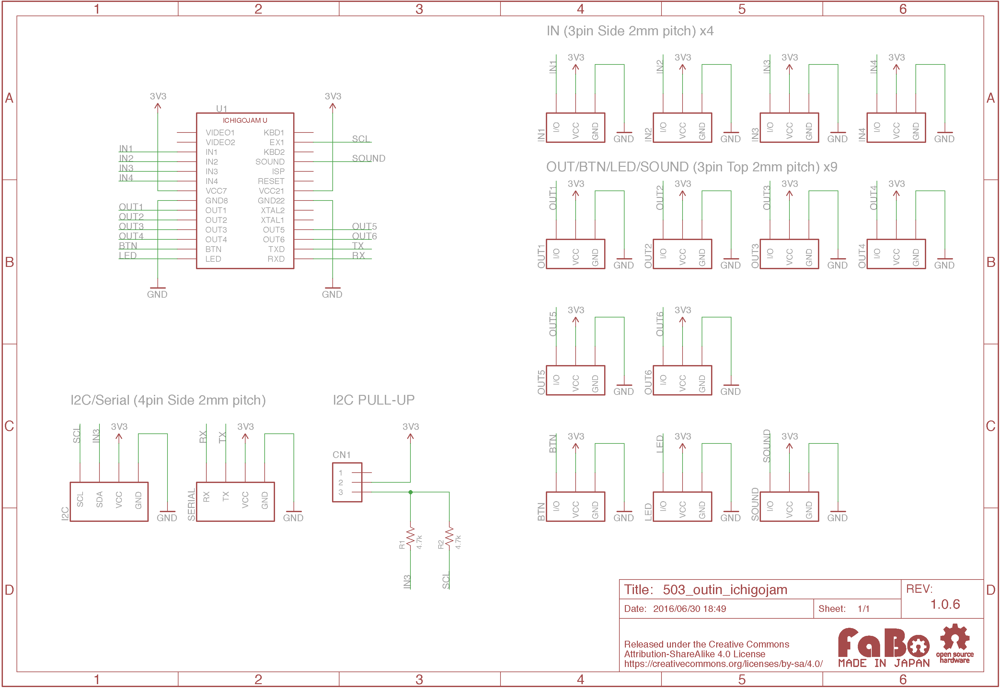

# #503 OUT/IN Shield for IchigoJam
  

<!--COLORME-->

## Overview
OUT/IN Shield for IchigoJamは、IchigoJamと各種センサーやボタンをケーブルを1本接続するだけで使えるIchigoJam対応シールドです。

IchigoJam本体、およびIchigoJamケースは含まれません。別途、お買い求めください。

## Schematic

### INコネクタ(3pin)
- IN1
- IN2
- IN3
- IN4

### BTNコネクタ(3pin)
### LEDコネクタ(3pin)
### SOUNDコネクタ(3pin)

### OUTコネクタ(3pin)
- OUT1
- OUT2
- OUT3
- OUT4
- OUT5
- OUT6

### I2Cコネクタ(4pin)
I2Cを使用する場合、プルアップ設定ジャンパをON側に設定してください。

### シリアルコネクタ(4pin)

## GitHub
- https://github.com/FaBoPlatform/FaBo/tree/master/503_outin_ichigojam
