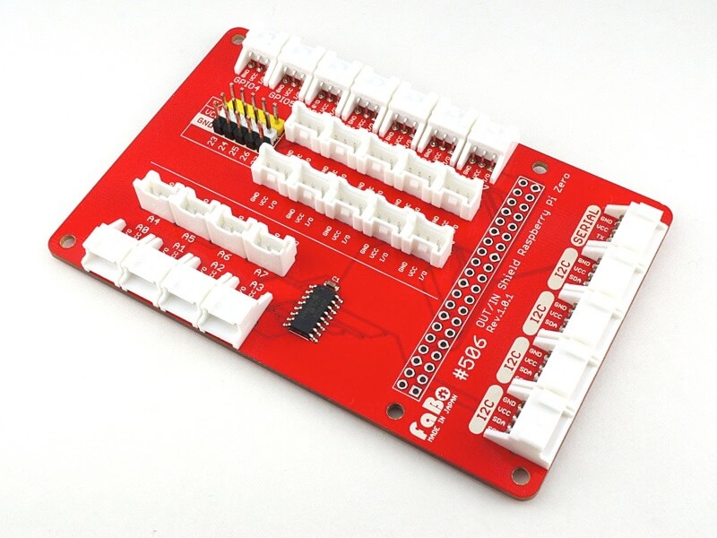
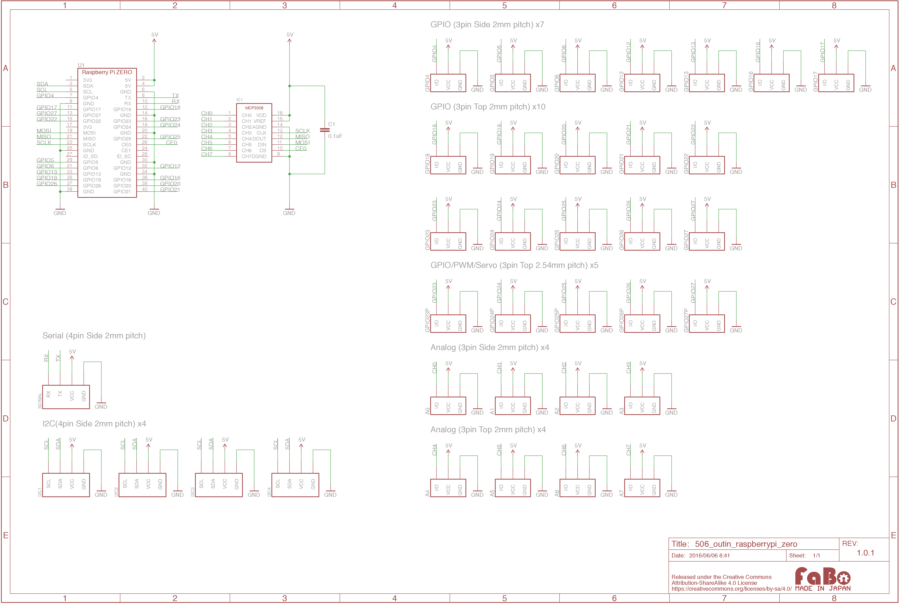

# #506 OUT/IN Shield for Raspberry Pi Zero

<!--COLORME-->

## Overview
OUT/IN Shield for Raspberry Pi Zeroは、Raspberry Pi Zeroと各種センサーやボタンをケーブルを1本接続するだけで使えるRaspberry Pi Zero対応シールドです。

Raspberry Pi Zero本体は含まれません。別途、お買い求めください。

### アナログコネクタ(3pin)
- A0
- A1
- A2
- A3
- A4
- A5
- A6
- A7

SPI接続の10bit ADコンバータがシールド上に実装されています

### GPIOコネクタ(3pin)
- GPIO4
- GPIO5
- GPIO6
- GPIO12
- GPIO13
- GPIO16
- GPIO17
- GPIO18
- GPIO19
- GPIO20
- GPIO21
- GPIO22
- GPIO23
- GPIO24
- GPIO25
- GPIO26
- GPIO27

### Servoコネクタ(3pin)
- サーボモータ接続用コネクタ(2.54mmピッチピンヘッダ)

GPIO23/GPIO24/GPIO25/GPIO26/GPIO27

### シリアルコネクタ(4pin)
### I2Cコネクタ(4pin)

## Schematic

## GitHub
- https://github.com/FaBoPlatform/FaBo/tree/master/506_outin_raspberrypi_zero
