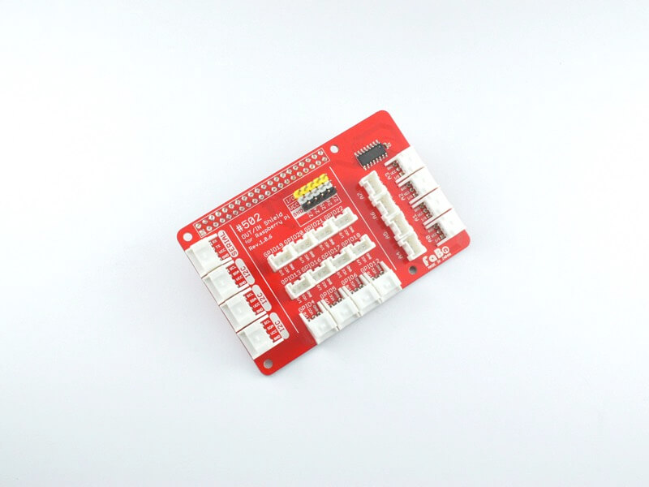
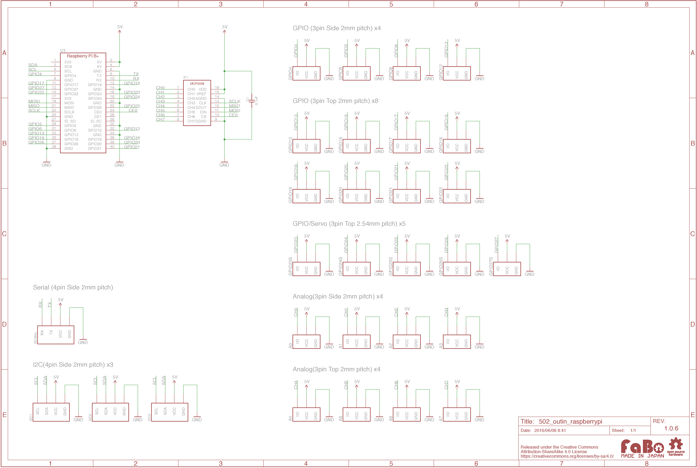

# #502 OUT/IN Shield for Raspberry Pi

  

<!--COLORME-->

## Overview
OUT/IN Shield for Raspberry Piは、Raspberry Piと各種センサーやボタンをケーブルを1本接続するだけで使えるRaspberry Pi対応シールドです。

Raspberry Pi本体、およびRaspberry Piケースは含まれません。別途、お買い求めください。

## Schematic


### アナログコネクタ(3pin)
- A0
- A1
- A2
- A3
- A4
- A5
- A6
- A7

SPI接続の10bit ADコンバータがシールド上に実装されています。

具体的な使用方法は、Analog Brickの各ページをご参照ください。

### GPIOコネクタ(3pin)
- GPIO4
- GPIO5
- GPIO6
- GPIO12
- GPIO13
- GPIO16
- GPIO17
- GPIO18
- GPIO19
- GPIO20
- GPIO21
- GPIO22

### Servoコネクタ(3pin)
- GPIO23
- GPIO24
- GPIO25
- GPIO26
- GPIO27

サーボモータ接続用コネクタ(2.54mmピッチピンヘッダ)

### シリアルコネクタ(4pin)

### I2Cコネクタ(4pin)

## I2CとSPIの有効化の設定方法

OUT/INシールドとBrickを使う際に、I2CとSPIを有効化する必要があります。

1. インターネットへ接続できる様に設定してください

* Raspberry Piを最新版にアップデートします
```shell
sudo apt-get update
sudo apt-get upgrade
sudo apt-get dist-upgrade
sudo rpi-update
sudo reboot
```
* raspi-configでI2CおよびSPIの有効化をします
```shell
sudo raspi-config
 メニューから[9 Advanced Options]>[A5 SPI]および[A6 I2C]を選択して有効化します
```
* I2C動作確認用のパッケージをインストールします
```shell
sudo apt-get install i2c-tools
```
* 再起動します
```shell
sudo reboot
```
* I2CのBrickが接続されている場合、次のコマンドでI2Cアドレスが表示されます
```shell
sudo i2cdetect -y 1
```
* サンプルで使用している、Pythonモジュールをインストールします
```shell
sudo apt-get install python-dev
sudo apt-get install python-smbus
sudo pip install spidev
```

## GitHub
- https://github.com/FaBoPlatform/FaBo/tree/master/502_outin_raspberrypi
