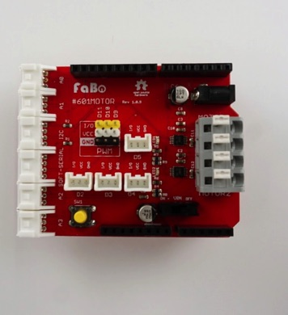
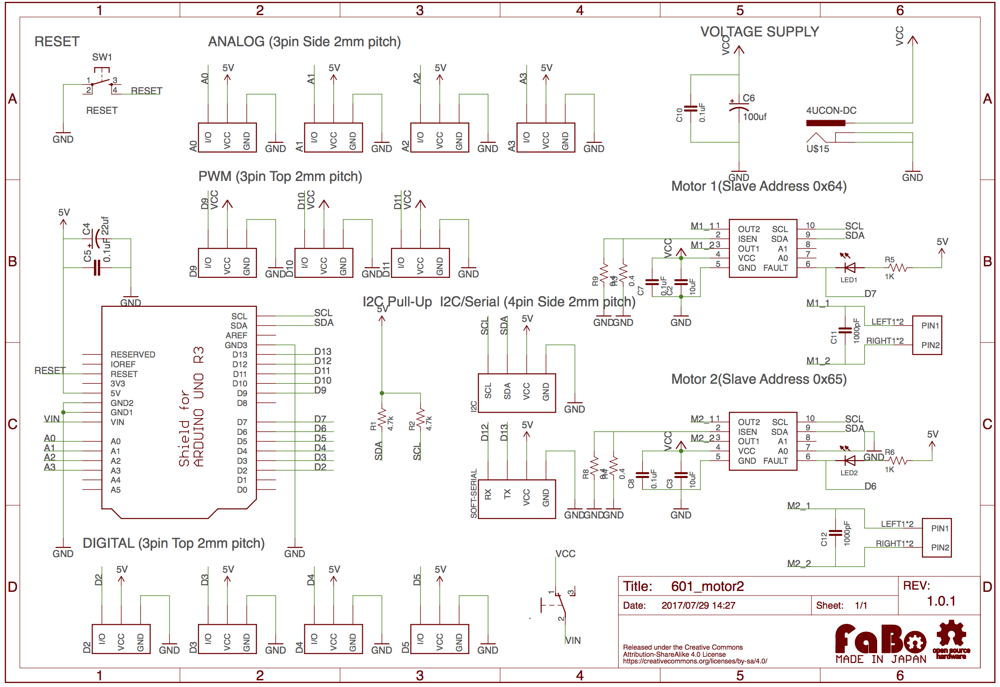

# #601 Motor Shield for Arduino

<!--COLORME-->

## Overview
I2C対応のMotor Driver(DRV8830)を2個搭載し、2つのモーター制御が可能です。

## 回路図

## コネクタ

### アナログコネクタ
- A0
- A1
- A2
- A3

### デジタルコネクタ
- D12
- D13

### PWM/Servoコネクタ
- サーボモータ接続用コネクタ
 - PWMに対応するD9

### シリアルコネクタ
SoftwareSerialとして使用するため、RX,TXはそれぞれ、D12,D13になります

### I2Cコネクタ
Arduino MEGAではR3以降から対応になります。
Arduino UNO R3/R2では使用可能です。

## DRV8830 Datasheet
| Document |
|:--:|
| [DRV8830](http://www.tij.co.jp/jp/lit/ds/symlink/drv8830.pdf) |

## Slave Address

| モーター | Slave Address |
|:--:|:--:|
| Motor1 | 0x64 |
| Motor2 | 0x63 |

## Github

https://github.com/FaBoPlatform/FaBo/tree/master/0601_motor
