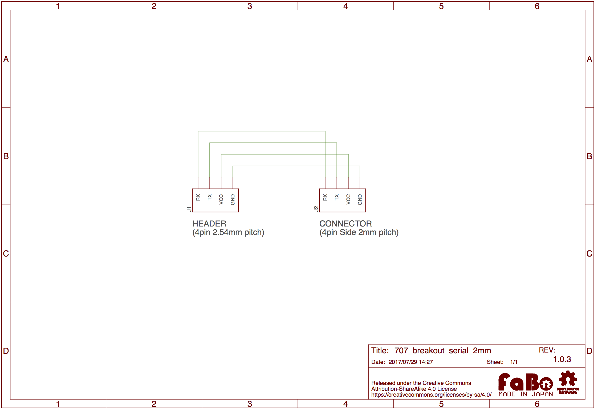

# #707 Serial Breakout

<!--COLORME-->

## Overview
Serial Breakoutは、FaBo Brick用Serialの2mmピッチコネクタと2.54mmピンヘッダの変換用ボードです。ブレッドボード等に挿して使用します。

## 回路図

## Github

https://github.com/FaBoPlatform/FaBo/tree/master/0707_breakout_serial_2mm
