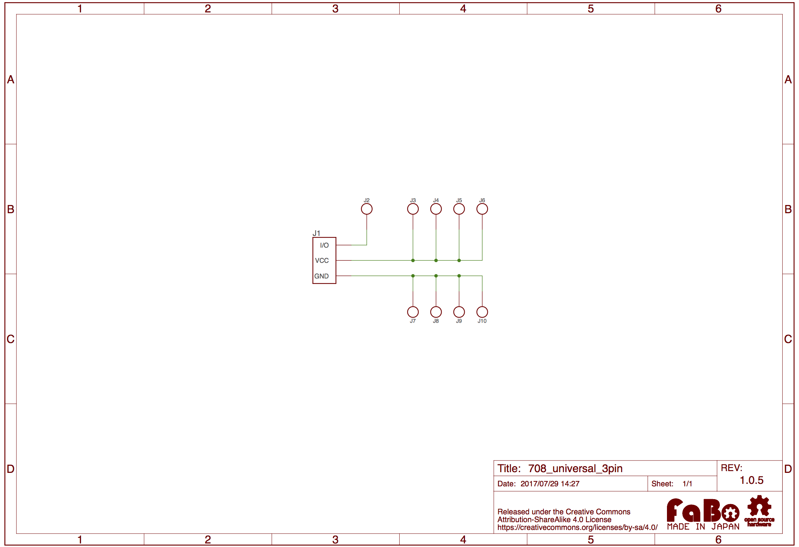

# #708 3Pin Universal

<!--COLORME-->

## Overview
3Pin Universalは、プロトタイピング用のBrickです。
部品を実装することでオリジナルのBrickを作成することができます。

## 図面

## Github

https://github.com/FaBoPlatform/FaBo/tree/master/0708_universal_3pin
