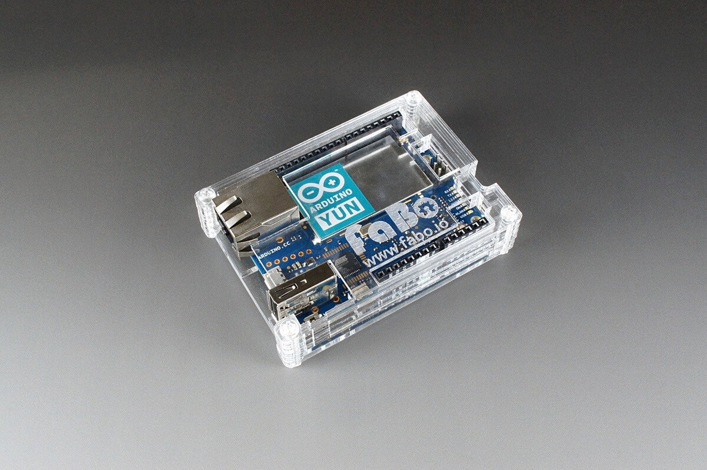
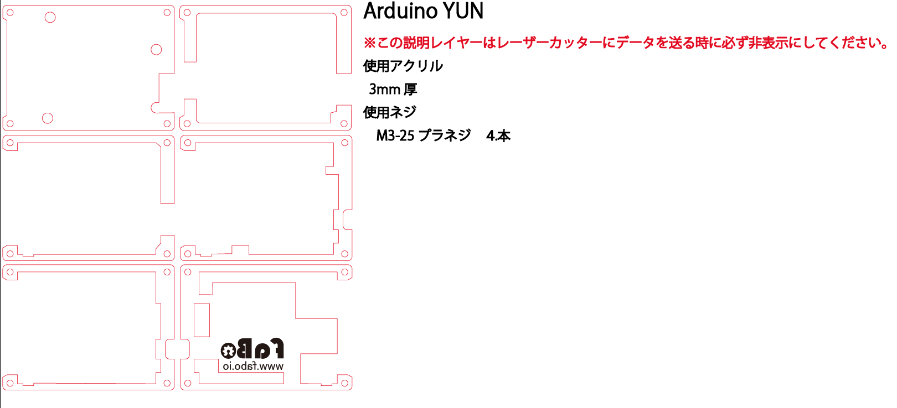
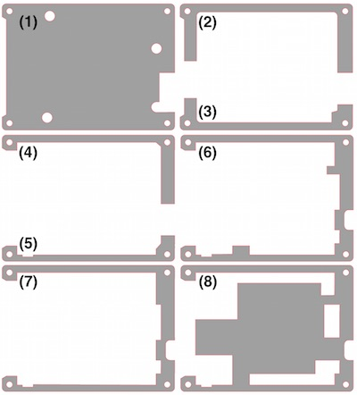
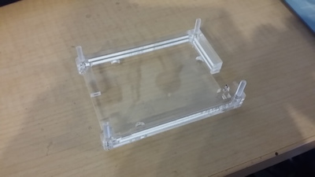
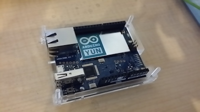
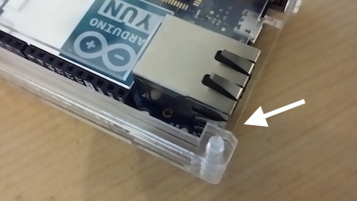

# #1103 Arduino YUNケース

<!--COLORME-->

**注文を受けてから生産しますので、納期にお時間をいただく場合があります。**

## Overview
Arduino YUN用のアクリル製ケースです。

**ケースのデザインは予告なく変更される場合があります。**

**マニュアルで使われている写真のパーツと、実際のパーツの色や形が異なる場合があります。あらかじめご了承ください。**

## 図面

## ケース構成

(1)が一番下、(8)が一番上になります。

使用ネジはM3-25プラネジ４本です。

## 組み立て方法
1.下から(1)、(2)、(3)、(4)、(5)を重ねます。
組み立て易くする為に、下から四方の穴にネジを差し込んでおきます。

(2)の上に(4)、(3)の上に(5)を重ねます。

ナットでの固定はしません。

2.ボードを(4)、(5)に合わせてセットします。

(4)、(5)がボードを上下を挟む形になります。

3.(6)、(7)、(8)を順番に重ねます。
(6)がボードを抑える形になります。

有線LANコネクタの張り部分に引っかからないよう注意して重ねます。

4.４本のネジをナットで固定します。ネジの方向は使用環境に応じて変えてください。

ゴムクッションはお好みでお使いください。

ネジが長いと感じる方はニッパーなどでカットしてください。
