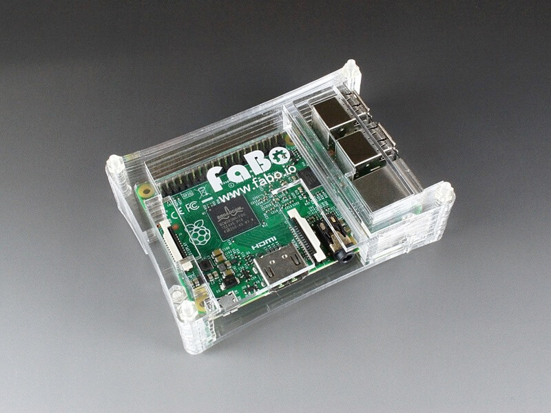
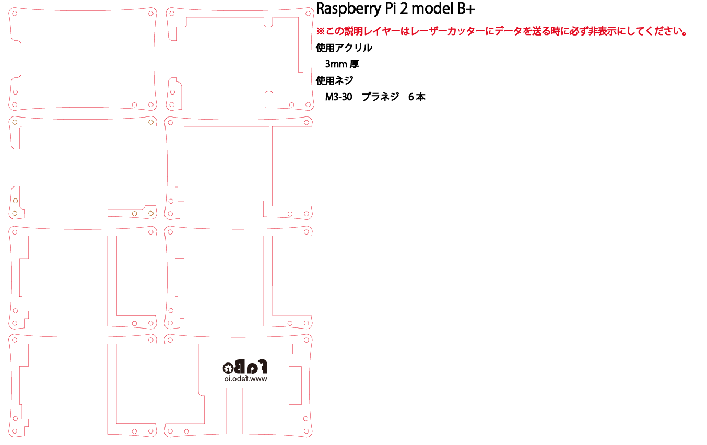
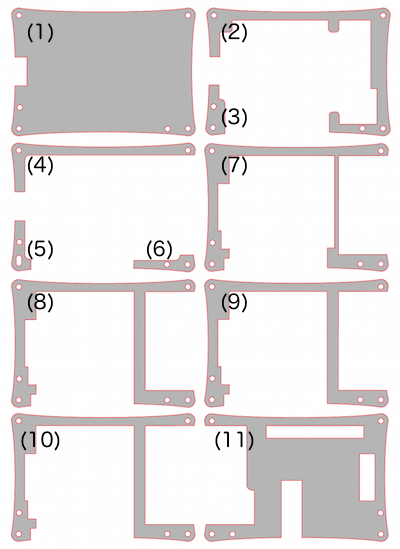
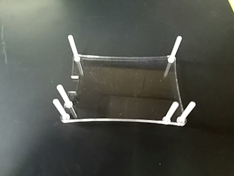
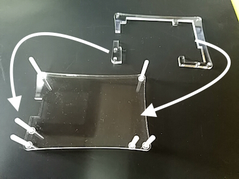
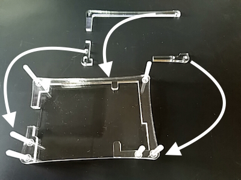
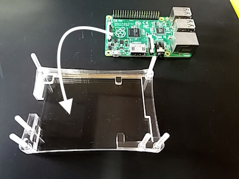
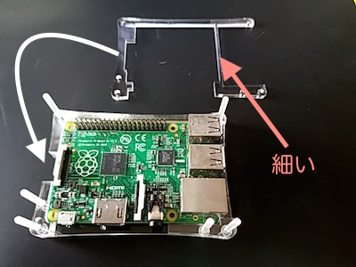
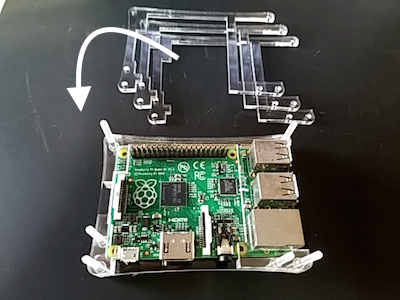
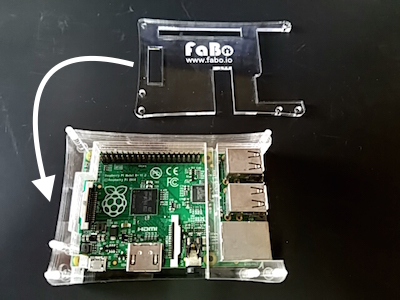

# #1104 RaspberryPi2 model Bケース

<!--COLORME-->

**注文を受けてから生産しますので、納期にお時間をいただく場合があります。**

## Overview
Raspberry PI2 model B用のアクリル製ケースです。

## 図面

**ケースのデザインは予告なく変更される場合があります。**

**マニュアルで使われている写真のパーツと、実際のパーツの色や形が異なる場合があります。あらかじめご了承ください。**

## ケース構成

使用ネジはM3-30プラネジ6本です。

重ねる際は方向に注意してください。

## 組み立て方法
1.　(1)の下からネジを図のようにセットします。

ナットでの固定はしません。

2.　手順１でセットしたネジに合わせて、図のようにパーツ(2)、(3)を重ねます。

3.　続けて(4)、(5)、(6)を重ねます。

4.　マイコンボードをセットし、被せるように(7)を重ねます。

注意　細い部分があります。

5.　(8)、(9)、(10)を順番に重ねます。

3パーツとも同じ形です。

6.　(11)を重ねます。

7.　ネジをナットで固定します。ネジの方向は使用環境に応じて変えてください。

ゴムクッションはお好みでお使いください。

ネジが長いと感じる方はニッパーなどでカットしてください。
