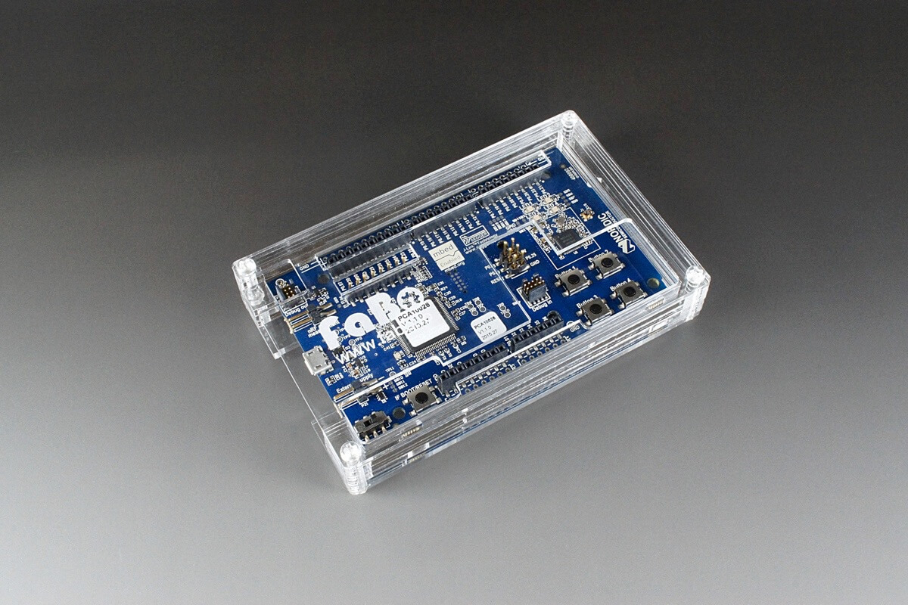
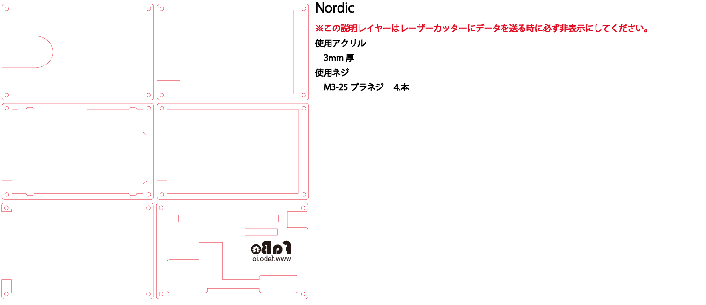
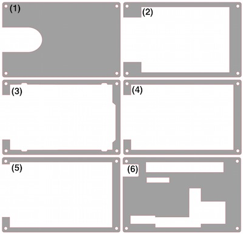
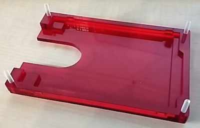
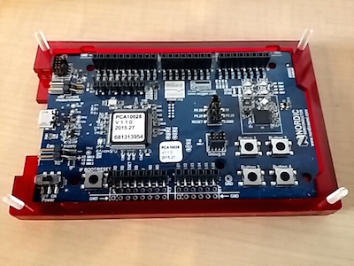
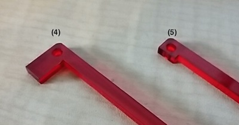

# #1107 Nordic(nRF51-DK)ケース

<!--COLORME-->

**注文を受けてから生産しますので、納期にお時間をいただく場合があります。**

## Overview
Nordic Semiconductor社のnRF51-DK用アクリル製ケースです。

## 図面

**ケースのデザインは予告なく変更される場合があります。**

**マニュアルで使われている写真のパーツと、実際のパーツの色や形が異なる場合があります。あらかじめご了承ください。**

## ケース構成

(1)が一番下、(6)が一番上になります。

使用ネジはM3-25プラネジ４本です。

重ねる際は方向に注意してください。

## 組み立て方法

1.　下から(1)、(2)、(3)を順番に重ねます。

組み立て易くする為に、下から四方の穴にネジを差し込んでおきます。

ナットでの固定はしません。

2.　(3)の内枠に合わせるようにボードをセットします。

ボードを(3)にハメ込む形になります。

3.　(4)、(5)、(6)を順番に重ねます。
(4)がボードを抑える形になります。

(4)(5)が類似しているので注意してください。左上部分が違います。

4.　ネジをナットで固定します。ネジの方向は使用環境に応じて変えてください。

ゴムクッションはお好みでお使いください。

ネジが長いと感じる方はニッパーなどでカットしてください。

## Github

https://github.com/FaBoPlatform/FaBo/tree/master/1107_case_nordic
