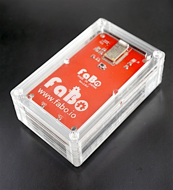
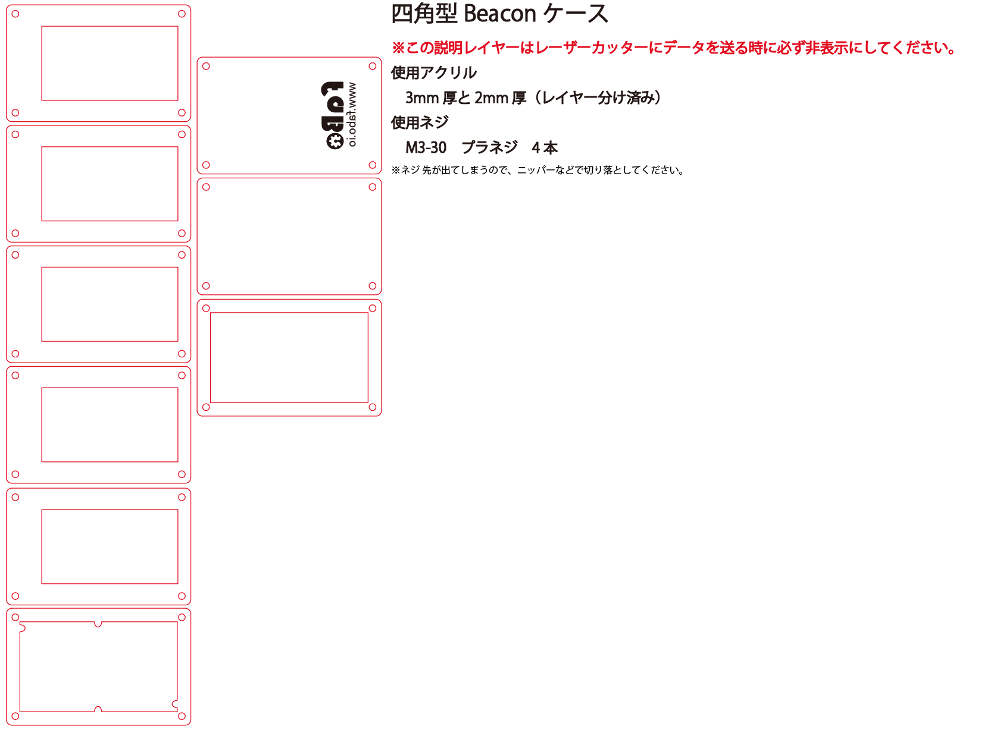
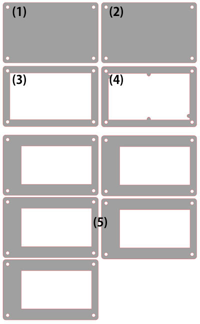
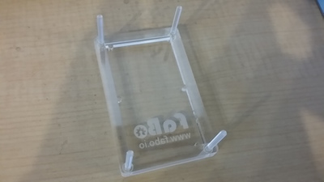
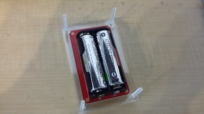
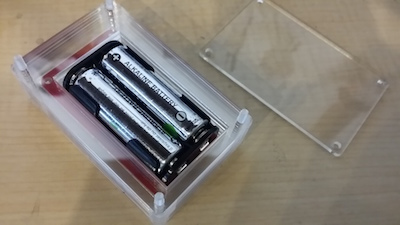
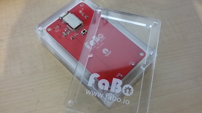

# #1110 Square iBeaconケース

<!--COLORME-->

## Overview
FaBo製「#802 iBeacon Square」用のアクリル製ケースです。

## 図面

**ケースのデザインは予告なく変更される場合があります。**

**マニュアルで使われている写真のパーツと、実際のパーツの色や形が異なる場合があります。あらかじめご了承ください。**

## パーツ構成

(1)と(2)は同じ形ですが、天板(1)には彫刻があります。

(5)の５枚も同じ形です。

## 組み立て方法

1.裏返し状態で、(1)、(4)、(3)の順番で重ね、ネジを(1)から通す。

2.ビーコンを裏返し状態でセットする。

※(3)の枠にハメ込む

3.５枚重ねた(5)を、最後に底蓋となる(2)をセットする。

4.ナットを取り付けて完成です。

## 注意
防水・防塵ではありません。

## 接着剤を用いる場合
(3)、(5)x5、(2)の順番に重ねて接着、同様に(1)、(4)を接着させれば、蓋と箱部分の２パーツとなります。

まっすぐ、ズレないように接着してください。

接着剤の成分により、透明アクリルが曇ってしまう場合あるので注意してください。
