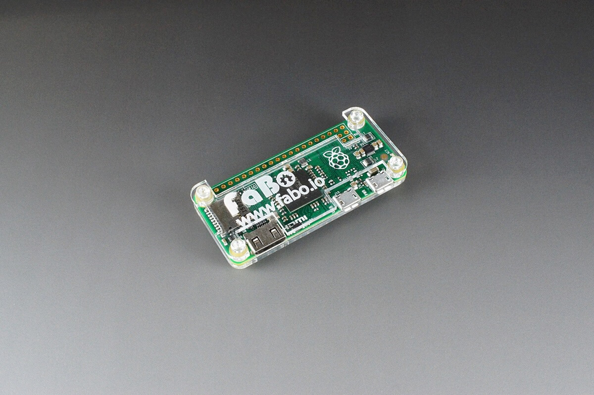
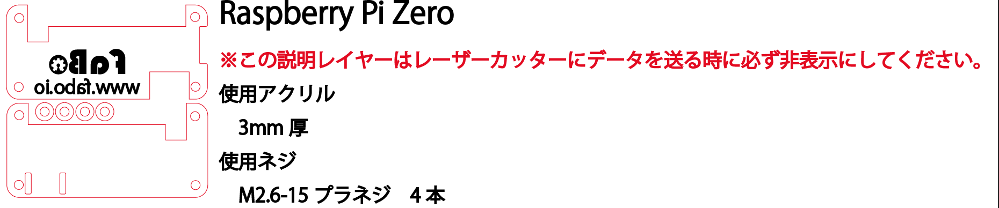
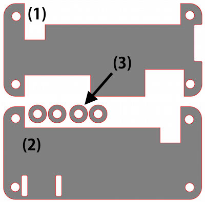
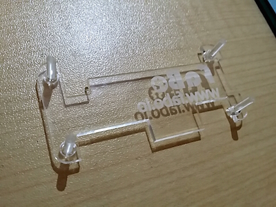
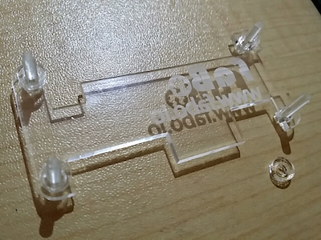
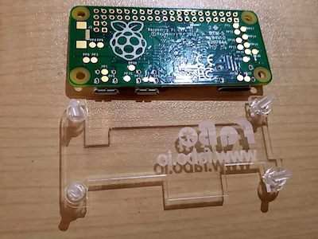
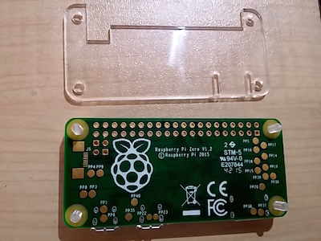

# #1111 RaspberryPi Zeroケース

<!--COLORME-->

**注文を受けてから生産しますので、納期にお時間をいただく場合があります。**

## Overview
Raspberry PI Zero用のアクリル製ケースです。

## 図面

**ケースのデザインは予告なく変更される場合があります。**

**マニュアルで使われている写真のパーツと、実際のパーツの色や形が異なる場合があります。あらかじめご了承ください。**

## パーツ構成

(1)が天板、(2)が底板、(3)はスペーサーです。

使用ネジはM2.6-10プラネジ４本です。

## 組み立て方法

1.　(1)を裏にして、ネジを４本差し込みます。

2.　(3)のスペーサーを４本のネジに通します。

3.　ボードを裏にしてネジに通します。

4.　(2)を裏返しにしてネジに通し、ナットで固定して完成です。

